# 具身智能VLA模型中的 Action Head 设计对比调研

参考：https://github.com/TianxingChen/Embodied-AI-Guide

## 一、写在前面——13个模型 Action Head 对比
在本调研中，选取13个VLA模型，对比13个模型中的Action Head设计。在报告中，我将13个模型中的Action Head设计大致分为三大类，分别为多分类器类、自回归类、扩散建模类。
下面两个表格分别为各种action head设计方式的对比表，以及各个模型的详细设计对照表。


---

## 主流 Action Head 设计方式对比表

| **设计主类**        | **子类设计方式**                | **代表模型**                                      | **频率** | **设计核心/机制**                                             | **优点**                                                   | **缺点**                                                   |
|---------------------|-------------------------------|--------------------------------------------------|--------------|-----------------------------------------------------------|-----------------------------------------------------|------------------------------------------------------------|
| **一、多分类器类**   | **多头分类器（维度独立分类）**     | RT-1                                             | 中           | 每个动作维度使用一个分类器，输出bin编号                      | 实现简单，训练稳定，适合多维控制                           | 无法建模时间依赖，控制不连贯，精度有限                    |                 
| **二、自回归类**     | **离散 token 预测**                | RT-2, OpenVLA, TraceVLA                          | 中高         | 动作离散为token，逐步生成token序列                           | 统一语言-动作token空间，结构简洁，兼容VLM                 | 推理慢，误差积累，不适合高频控制                          |
|                     | 草图条件 token 输出            | RT-Trajectory                                    | 中           | 用户绘制轨迹图+观测图送入模型，输出动作token序列             | 人机交互友好，可引导轨迹生成                               | 仅限支持图像提示任务                                       |
|                     | Token压缩（频域+BPE）          | FAST（π0附属）                                   | 高           | 动作频域DCT压缩+BPE编码为短token序列                         | 推理速度极快，token数大幅减少，压缩率高                   | 压缩损失可能影响极端精度；需可逆设计                      |
|                     | 动作网格离散（空间token）      | SpatialVLA                                       | 高           | 预定义空间网格+每帧输出3个token（平移、旋转、gripper）        | 空间感知强，token效率极高                                 | 需统计先验分布，灵活性差                                  |
| **三、扩散建模类**   | **标准扩散（DDPM）**               | Octo, CogACT, Diffusion-VLA, TinyVLA             | 高           | 使用多步扩散生成连续动作向量，支持chunk输出                  | 高精度、高表达力，chunk生成，支持非自回归控制             | 推理慢，训练成本高，扩散过程复杂                         |
|                     | **Flow Matching（ODE建模）**       | π0                                               | 高           | 学习动作向量场，使用欧拉积分从初始噪声生成动作                | 速度快，接近扩散质量但更高效                               | 积分路径与训练范数要求高                                |
|                     | Latent Diffusion + MLP 解码    | RDT-1B                                           | 超高         | 在latent空间扩散，MLP恢复控制序列，支持双臂控制               | 控制频率高（300Hz+），适合多机器人系统                    | 架构复杂，对训练/注入策略依赖大                           |
|                     | Reasoning-Injection扩散        | CogACT, Diffusion-VLA                            | 高           | 先用LLM进行任务推理，reasoning token 作为扩散输入条件         | 可解释性好，语义控制强，适合多阶段复杂任务                | 模块解耦多，训练成本高，对任务规划依赖高                  |

- 文章后续会详细分析多分类方式中的**多分类器**、自回归方式中的**离散token预测**以及扩散建模方式中的**DDPM**与**FLOW MATCHING**建模方式。

---


## 13种模型的 Action Head 设计方式对比表
| 模型         | Action Head             | 是否自回归 | 是否使用扩散 | 控制频率 | token 数 | 特点简述                              |
|--------------|--------------------------|--------------|----------------|------------|-------------|---------------------------------------|
| RT-1         | 多分类器（11维）         | 否           | 否             | 中         | 无         | 并行输出，结构简单                    |
| RT-1         | 多分类器（11维）         | 否           | 否             | 中         | 11         | 并行输出，结构简单                    |
| RT-2         | 离散token自回归          | 是           | 否             | 中         | 7-8        | 与语言token统一                       |
| RT-Trajectory| 草图条件控制 + transformer | 是         | 否             | 中         | /         | 支持用户可绘制控制                    |
| OpenVLA      | 离散token（映射VLM空间）  | 是           | 否             | 中         | 7          | 与RT-2相似，支持LoRA量化              |
| TinyVLA      | Diffusion Policy（简化）  | 否           | 是             | 高         | 无         | 单步输出，极速推理                    |
| TraceVLA     | 离散token + 轨迹提示     | 是           | 否             | 高         | 7          | 提高空间-时间理解                     |
| Octo         | Diffusion + Chunk Decoder | 否           | 是             | 高         | 无         | 支持长序列chunk输出                   |
| π0           | Flow Matching + Expert     | 否           | 是             | 高         | 无         | 较快推理速度，支持动作连贯建模       |
| CogACT       | LLM推理 + Diffusion Head  | 否           | 是             | 高         | 无         | 解耦推理与控制模块，具可解释性       |
| Diffusion-VLA| FiLM注入 + Latent Diffusion | 否        | 是             | 高         | 无         | Reasoning token引导控制               |
| FAST（π0）         | DCT压缩 + BPE token       | 是           | 否             | 高         | 30-60      | token效率最优，自回归但推理极快      |
| SpatialVLA   | Adaptive Grid token       | 是           | 否             | 高         | 3          | 空间感知强，低token数                 |
| RDT-1B       | Latent Diffusion + MLP    | 否           | 是             | 超高       | 无         | 支持双臂、底盘控制，兼容多平台        |

## 二、Action Head的定义
Action head的命名在业界似乎不太一致。模型如Octo，在论文中有明确提到action head模块；但是其他的模型如π0等，虽然有类似的功能模块，但是没有明确命名为action head模块（文章中定义了一个action expert模块，实现的功能类似于Octo种的action head模块）；也有模型如RT-2，在论文中并没有明确定义为action head模块，而是直接将transformer模块中的输出映射到token空间，作为控制指令输出，也同样实现了类似的功能。

在论文[A Survey on Vision-Language-Action Models for Embodied AI](https://arxiv.org/abs/2405.14093)中，作者在文中提出了一套通用的VLA模型架构，主要由六个核心模块构成（详见下图）：

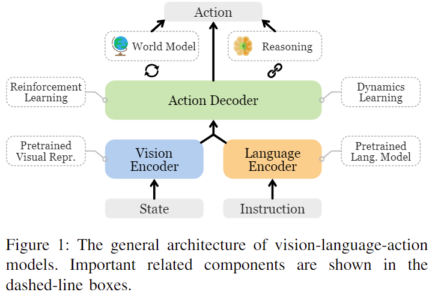
- 视觉编码器（Vision Encoder），如ViT、SAM等，用于提取图像特征；
- 语言编码器（Language Encoder），如BERT、PaLM等，用于理解自然语言指令；
- 融合模块（Multimodal Fusion）负责将视觉与语言信息进行联合建模；
- 动作解码器（Action Decoder / Policy）用于根据融合后的表示生成机器人可执行的控制指令；
- 世界模型（World Model）用于模拟环境中的状态转移与反馈，辅助模型进行任务规划与预判；
- 推理模块（Reasoning Module）则支持多阶段决策过程，能够实现类似Chain-of-Thought的推理策略，从而增强模型的认知与规划能力。
  
在此报告中，**Action Head的功能与Action Decoder功能类似**，故我们将action head模块粗略的定义为：**模型中负责接收Vision与Language融合表示并输出控制指令的关键模块。**
具体而言，Action Head 的任务是将多模态感知（如图像、文本指令、历史观测等）的输出转换为机器人可执行的连续控制信号（如位置、姿态、夹爪开合等）。
一个设计良好的 Action Head 不仅能够表达足够复杂的控制策略，还需保证推理速度、可泛化能力和高精度输出。在实践中，Action Head 的设计方式对整个VLA模型的实用性有决定性影响。


## 三、常见 Action Head 设计方式与原理解析

### 1. 多分类器（RT-1）
将每个控制维度离散为固定bin数（如256），每个维度设置一个分类器。模型以并行方式输出11个分类结果（对应于机械臂7自由度+底盘3维度+模式切换）。

**优点：** 实现简单、训练稳定，适合大规模数据。
**缺点：** 无法建模动作之间的时间连贯性，对于精细控制不够表达力。

#### 以RT-1为例
- 代码未公开
  
RT-1 中的多分类器（multi-class classifier）实现方式，是将机器人每个控制维度的连续动作值离散化成固定数量的 bins（通常是 256 个），然后对每个维度分别使用一个独立的 softmax 分类器进行预测。总共输出 11 个分类结果，分别对应于 7 个机械臂自由度（通常是 end-effector 的 position + rotation）、3 个底盘运动维度（x、y 速度和角速度），以及一个模式切换（如打开/关闭夹爪）。这样做的好处是可以把连续动作空间转换成离散 token，从而使动作生成任务与语言生成任务结构一致，统一到“下一个 token”的预测框架中，方便使用类似语言模型的 transformer 架构。具体实现中，训练时每个维度都会有一个交叉熵损失，所有维度的 loss 相加即为总的动作预测损失。模型在推理时会为每个维度独立预测一个类别 index（即 bin 编号），然后通过查表或插值还原为连续动作值，最终组成完整的控制指令。这种设计允许高效地并行预测多个维度，同时避免高维连续回归带来的不稳定性或精度下降问题。

### 2. 自回归 token 预测（RT-2, OpenVLA 等）
将连续动作离散为 token，每次预测一个 token，类似语言生成。多个 token 拼接成完整动作序列。

**优点：** 可与语言模型统一架构整合，支持多模态条件推理。
**缺点：** 推理速度慢、误差积累严重、不适合高频控制场景。

#### 以OpenVLA为例
- 代码：https://github.com/openvla/openvla **action head**位于`prismatic/vla/action_tokenizer.py`


① **自回归 token 预测任务**  
OpenVLA 将机器人动作预测建模为一个自回归 token 预测任务：将连续动作离散为 token，并用语言模型按“下一个 token”的方式逐步生成这些 token。每个 token 表示动作的一维或一部分，多个 token 拼接成完整的动作。


② **动作离散化方式**  
在 `ActionTokenizer` 中，连续动作范围（默认是 [-1, 1]）会被均匀分成 256 个 bin。以 NumPy 实现如下：
```python
self.bins = np.linspace(min_action, max_action, self.n_bins)
```
然后用 `np.digitize()` 将动作值转成 bin 编号。每个编号表示该维度动作落在某个区间内，例如 bin 128 表示动作值落在中间区间附近。


③ **token 映射策略**  
为了和语言模型词表对接，OpenVLA 不扩展词表，而是用词表中**最少使用的末尾若干个 token**来表示动作 bin。映射方式如下：
```python
token_id = tokenizer.vocab_size - discretized_bin
```
例如，如果 vocab size 是 32000，那么 bin 1~256 就映射为 31744~31999 的 token ID。


④ **模型训练过程**  
训练时输入是图像 token + 指令 token，目标是生成动作 token 序列。形式如下：
```
[图像 token] + [指令 token] → [动作 token_1, token_2, ..., token_k]
```
训练目标是标准的语言建模目标：预测下一个 token，使用交叉熵损失。整个训练过程就是在做条件语言建模，只不过目标 token 是离散化后的动作。


⑤ **推理过程**  
推理时，模型会像语言模型生成句子一样，逐步生成动作 token：
- 每一步预测当前 token 的概率分布（vocab 上的 softmax）
- 取最大概率（或采样）作为输出 token
- 累积生成所有动作 token，最终拼接还原动作序列

生成后的 token 序列再通过 `decode_token_ids_to_actions()` 映射为连续动作向量，供机器人执行。


⑥ **token 解码为动作值**  
解码函数核心逻辑如下：
```python
discretized_actions = vocab_size - token_ids
discretized_actions = np.clip(discretized_actions - 1, 0, 254)
action_value = bin_centers[discretized_actions]
```
其中 `bin_centers` 是每个离散区间的中心值，代表实际控制信号，最终还原为连续动作。


### 3. 扩散建模（DDPM, Flow-Matching）
采用DDPM或Flow Matching框架，在动作空间中逐步还原无噪声动作。典型如 Octo、π0、CogACT、RDT-1B。

**优点：** 表达力强，能建模动作序列的多样性和平滑性，支持chunk输出。
**缺点：** 训练和推理成本高，需调节扩散步数和学习率，对数值稳定性有要求。

#### 以Octo和π0为例
#### Octo —— DDPM
- 代码：https://github.com/octo-models/octo **action head**位于`octo/model/components/action_heads.py`

 ① **核心思想：扩散建模恢复动作**

Octo 中的 Diffusion Action Head 使用扩散模型（DDPM）进行动作建模。目标是通过逐步去噪，从噪声中恢复出真实动作。每个时间步，模型通过预测去噪误差（\( \epsilon_\theta \)），并应用噪声调度来还原动作。

 ② **训练阶段：加噪动作与损失计算**

在训练阶段，给真实动作加噪并学习预测噪声：

```python
# 加噪动作
A_τ = sqrt(τ) * noise + sqrt(1 - τ) * actions
u_τ = noise - actions  # 目标是去噪

# 计算损失
loss = jnp.mean(jnp.square(pred_eps - u_τ))
```

- `τ` 为噪声调度参数，控制噪声水平。
- `pred_eps` 为模型预测的噪声。

 ③ **推理阶段：去噪过程（采样动作）**

推理时，从标准高斯噪声开始，通过扩散过程逐步去噪，生成最终动作：

```python
# 初始化噪声
noise = jax.random.normal(key, shape)
# 扩散过程
for t in range(diffusion_steps):
    eps_pred = model(noisy_actions, time=t)
    noisy_actions = noisy_actions - eps_pred * scale_factor
```

每步更新噪声，通过 `model()` 预测去噪，并逐步还原动作。

 ④ **关键方法：生成动作**

最终通过去噪步骤生成完整的动作序列：

```python
# 扩散采样
actions = sample_from_diffusion_model(transformer_outputs, noise)
```

模型输出的是每个时间步的动作，最终得到动作序列。


⑤ **总结**

Octo 的 Diffusion Action Head 通过扩散过程学习从噪声中恢复动作，采用条件扩散模型逐步去噪生成动作。训练时加入噪声，推理时通过扩散采样生成动作，适合高精度控制任务。


#### π0 —— Flow-Matching
- 代码：https://github.com/Physical-Intelligence/openpi **action head**位于`src/openpi/models/pi0.py`


① **训练阶段：学习 denoising 向量场**

- 对 ground-truth 动作 `actions` 加噪得到：
  ```python
  A_τ = sqrt(τ) * noise + sqrt(1 - τ) * actions
  u_τ = noise - actions
  ```
- 嵌入方式：动作 `A_τ` 和时间 `τ` 拼接后送入 MLP，构造 token：
  ```python
  time_emb = posemb_sincos(τ)
  action_token = MLP([A_τ, time_emb])
  ```
- 送入 transformer，输出向量场预测：
  ```python
  v_θ = transformer([prefix, action_token])
  loss = mean((v_θ - u_τ)²)
  ```


② **推理阶段：欧拉积分还原动作**

- 初始化高斯噪声动作：
  ```python
  x₀ ∼ N(0, I)
  τ = 1.0
  ```
- 每步向前积分：
  ```python
  v_t = model(x_t, τ)
  x_{t+1} = x_t + dt * v_t
  ```
- 共 10 步，最终 `x₀` 为生成动作。


③ **总结**

π0 将动作看作连续变量，在训练中学习从噪声还原动作的向量场（Flow Matching），在推理中用前向积分一步步生成动作，具备高效、高频、非自回归控制能力。


  


## 四、VLA整体模型架构概览

在VLA模型中，Action Head 并不是独立存在的模块，而是位于整体系统架构的末端，紧接在以下几类模块之后：

1. **视觉编码器（Visual Encoder）**：如DINOv2、SigLIP、ViT，提取图像特征。
2. **语言模型（Language/Multimodal Model）**：如PaLI-X, PaLM-E, LLaMA, Qwen-VL，理解指令或多模态对话。
3. **决策推理模块（Reasoning Module）**：如CogACT、Diffusion-VLA中使用LLM reasoning token；RT-Trajectory使用草图轨迹。
4. **控制解码器（Action Decoder / Head）**：将前面全部信息映射为连续控制指令。

下面逐一拆解13个模型的整体结构，并指出 Action Head 所在的位置：

### 1. RT-1
- 架构：图像编码器（EfficientNet）+ 任务指令嵌入（USE）+ 多层Transformer → 多分类器
- Action Head：位于输出末端，逐维输出动作分类。
  

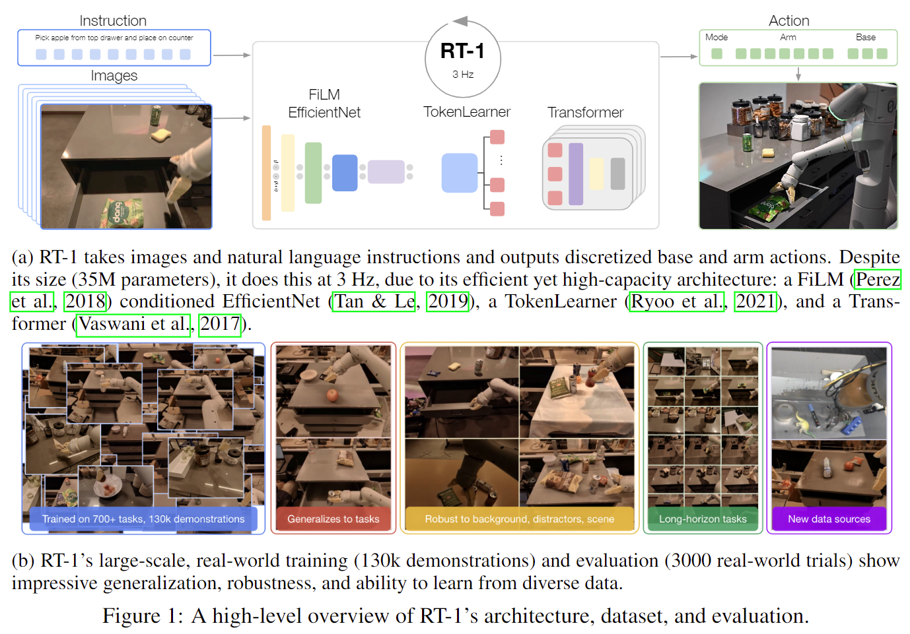 

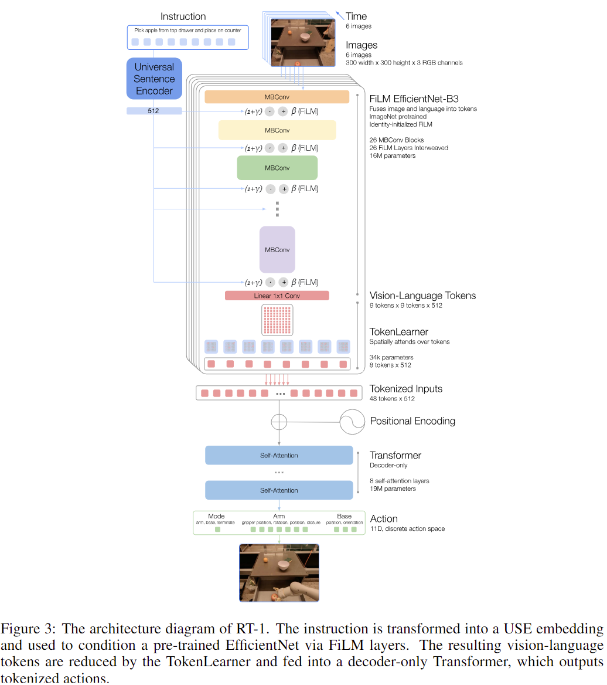

---


### RT-1 模型架构详解

RT-1 是一个以 Transformer 为核心的多模态机器人控制模型，其输入为语言指令和图像观测，输出为一系列离散的控制动作。每个动作维度由单独的分类器进行预测，最终得到完整的动作向量。

① **图像编码器（EfficientNet）**

RT-1 使用 **EfficientNet** 来处理图像输入，首先通过预训练的 **EfficientNet-B3** 模型对图像进行编码，提取图像特征。该图像编码器输出一个形状为 9x9x512 的特征图。

- **输入格式**：图像经过 EfficientNet 编码生成图像 tokens：
  ```
  [图像] → [图像 token_1, token_2, ..., token_81]
  ```
  每个 token 表示图像的一个局部区域（patch）。

② **语言指令编码器（Universal Sentence Encoder, USE）**

RT-1 使用 **Universal Sentence Encoder（USE）** 对语言指令进行编码，将自然语言转化为固定长度的语义向量。该语义向量与图像特征向量进行结合，用于指导模型生成控制动作。

- **输入格式**：语言指令经过 USE 转化为 token 序列：
  ```
  [语言指令] → [指令 token_1, token_2, ..., token_m]
  ```
  每个 token 表示语言中的一个单词或子词。

③ **FiLM 层条件化**

图像 token 和语言 token 被结合在一起，通过 **FiLM（Feature-wise Linear Modulation）** 层对图像编码器进行条件化，使得图像特征与语言指令关联，从而加强模型对任务的理解。FiLM 层允许图像特征在语言指导下得到调整。

④ **TokenLearner**

为了进一步压缩 token 的数量并加速推理，RT-1 使用了 **TokenLearner** 模块。这一模块通过学习对图像 token 进行选择性筛选，从而仅保留对当前任务最重要的图像信息。这减少了 Transformer 编码器的计算负担。

- **输出格式**：通过 TokenLearner 模块，RT-1 只保留 8 个视觉 token：
  ```
  [图像 token_1, ..., token_81] → [token_1, token_2, ..., token_8]
  ```

⑤ **Transformer 编码器**

经过 TokenLearner 精简后的图像 token 和语言 token 被拼接，输入到 **Transformer 编码器** 中。Transformer 模型由多个自注意力层组成，能够捕捉图像与语言之间的复杂关系。最终输出的 token 表示了图像和语言模态之间的融合信息。

- **输入格式**：拼接后的图像和语言 token 输入到 Transformer 编码器：
  ```
  [图像 token_1, ..., token_8] + [指令 token_1, ..., token_m] → [输出 token_1, ..., token_(8+m)]
  ```

⑥ **动作离散化（Action Discretization）**

RT-1 将每个动作维度离散化为 256 个 bins。每个动作维度的离散化动作被视作一个独立的分类问题，采用分类器预测每个动作维度的离散值。

- **token 格式**：每个动作维度通过分类器输出 256 个 token：
  ```
  [动作维度_1] → [动作 token_1, token_2, ..., token_256]
  [动作维度_2] → [动作 token_257, token_258, ..., token_512]
  ```

⑦ **动作头（Action Head）**

Transformer 输出的 token（特别是图像 token）通过多个并行的分类器进行预测，每个分类器负责预测一个动作维度的离散化值。最终模型输出 11 个动作维度的预测结果。

- **输出格式**：每个动作维度通过分类器输出 256 个 token，最终拼接成完整的动作序列：
  ```
  [动作 token_1, token_2, ..., token_256] + [动作 token_257, token_258, ..., token_512] → [完整的动作 token 序列]
  ```

⑧ **推理过程（Inference）**

推理时，模型逐步生成动作 token 序列。每个时间步，模型基于已经生成的动作 token 和当前图像、语言信息预测下一个动作 token。最终生成的动作 token 序列会通过解码还原为连续的控制信号。

- **生成过程**：
  ```
  [图像 token] + [指令 token] + [动作 token_1, ..., token_i] → [动作 token_{i+1}]
  ```
  每一步预测一个新的动作 token，直到生成完整的动作序列。

⑨ **动作解码（Action Decoding）**

生成的动作 token 序列通过解码器被转化为连续的控制信号。每个 token 根据其对应的离散区间进行解码，最终得到机器人可执行的控制信号。

- **解码格式**：
  ```
  [动作 token_1, token_2, ..., token_k] → [动作值_1, 动作值_2, ..., 动作值_k]
  ```

RT-1 通过将图像、语言和动作任务视为序列建模问题，采用 Transformer 进行处理。通过将动作离散化为 token 序列，RT-1 能够高效地执行控制任务，并展现出强大的零-shot 泛化能力。这一架构使得 RT-1 能够在多任务、跨模态的环境中实现实时机器人控制。

---


### 2. RT-2
- 架构：图像编码器 + LLM backbone（PaLI-X, PaLM-E）+ 动作token输出
- Action Head：token自回归生成动作，动作与语言共用词表。

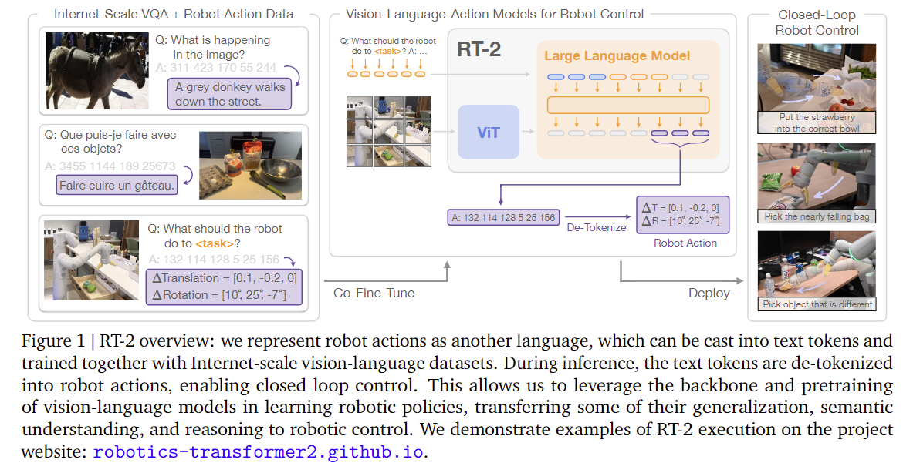 


---
#### RT-2 模型架构详解

① **图像编码器（Vision Encoder）**

RT-2 使用 **Vision Transformer（ViT）** 来编码图像输入。图像会被划分为若干个 patch，并通过 ViT 转换为一系列图像 tokens。这些 token 表示图像的不同区域。

- **输入格式**：图像经过 ViT 生成图像 tokens：
  ```
  [图像] → [图像 token_1, token_2, ..., token_n]
  ```
  这里的每个 token 是图像的一个部分（patch）表示。


② **语言编码器（Text Encoder）**

RT-2 使用一个强大的预训练语言模型（如 PaLM-E 或 PaLI-X）来编码语言指令。该语言模型将自然语言指令转换为固定长度的语义向量。

- **输入格式**：语言指令被转换为 token 序列：
  ```
  [语言指令] → [指令 token_1, token_2, ..., token_m]
  ```
  这里的每个 token 表示一句话中的一个单词或子词。


③ **特征融合与位置编码**

将图像 tokens 和语言 tokens 进行拼接，形成一个联合的输入序列。为了让 Transformer 理解每个 token 的来源（图像或语言），RT-2 使用了位置编码和 token 类型编码。

- **token 格式**：图像 token 和语言 token 被拼接成一个联合序列：
  ```
  [图像 token_1, token_2, ..., token_n] + [指令 token_1, token_2, ..., token_m] → [联合 token_1, token_2, ..., token_(n+m)]
  ```


④ **多层 Transformer 编码器**

拼接后的图像和语言 tokens 被送入多层 **Transformer 编码器** 中。Transformer 中的多头自注意力机制能够捕捉图像与语言之间的复杂关系。输出的 token 表示了两种模态的融合信息。

- **输出格式**：Transformer 输出的 token 序列包括来自图像和语言的上下文信息：
  ```
  [联合 token_1, token_2, ..., token_(n+m)] → [输出 token_1, token_2, ..., token_(n+m)]
  ```


⑤ **动作离散化（Action Discretization）**

RT-2 将机器人的控制动作离散化为多个 bins，每个动作维度（如位置或旋转）会被离散化为 256 个 bin，每个 bin 对应一个 token。

- **token 格式**：动作的每个维度被离散化为 256 个 token：
  ```
  [动作维度_1] → [动作 token_1, token_2, ..., token_256]
  [动作维度_2] → [动作 token_257, token_258, ..., token_512]
  ```
  这里每个动作维度（如位置或角度）都生成一个包含 256 个 token 的序列。


⑥ **动作头（Action Head）**

RT-2 使用多个并行的分类器（一个分类器对应一个动作维度）来预测每个动作的 token。每个分类器输出一个 256 维的概率分布，表示该动作维度的离散化控制值。最终的动作是这些 token 序列的组合。

- **token 格式**：每个动作维度通过分类器输出 256 个 token：
  ```
  [动作 token_1, token_2, ..., token_256] + [动作 token_257, token_258, ..., token_512] → [完整的动作 token 序列]
  ```


⑦ **推理过程（Inference）**

在推理阶段，RT-2 逐步生成动作 token 序列。每一步，模型根据之前生成的动作 token 和当前输入的图像与语言条件预测下一个动作 token。最终，生成的动作 token 序列将被解码为连续的动作值。

- **生成过程**：
  ```
  [图像 token] + [指令 token] + [动作 token_1, ..., token_i] → [动作 token_{i+1}]
  ```
  每一步生成一个新的动作 token，直到生成完整的动作序列。


⑧ **动作解码（Action Decoding）**

生成的动作 token 序列通过解码器被转化为连续的控制信号。每个 token 会根据其对应的离散区间（由 bin 中心表示）进行解码。

- **解码格式**：
  ```
  [动作 token_1, token_2, ..., token_k] → [动作值_1, 动作值_2, ..., 动作值_k]
  ```
  生成的 token 会映射回实际的控制信号，最终得到机器人执行的动作。


⑨ **总结**

RT-2 架构利用图像和语言的多模态信息，通过 **Transformer** 进行有效的特征融合。它将机器人控制动作离散化为 token，并使用多个分类器来逐步预测动作序列，最终通过解码生成连续的控制信号。这一方法能够处理图像与语言之间的复杂关系，具有很强的任务泛化能力。

--- 


### 3. RT-Trajectory
- 架构：轨迹草图图像 + 当前观测图像 + Transformer → 输出连续动作向量
- Action Head：为transformer输出层，直接预测动作（非token化）。

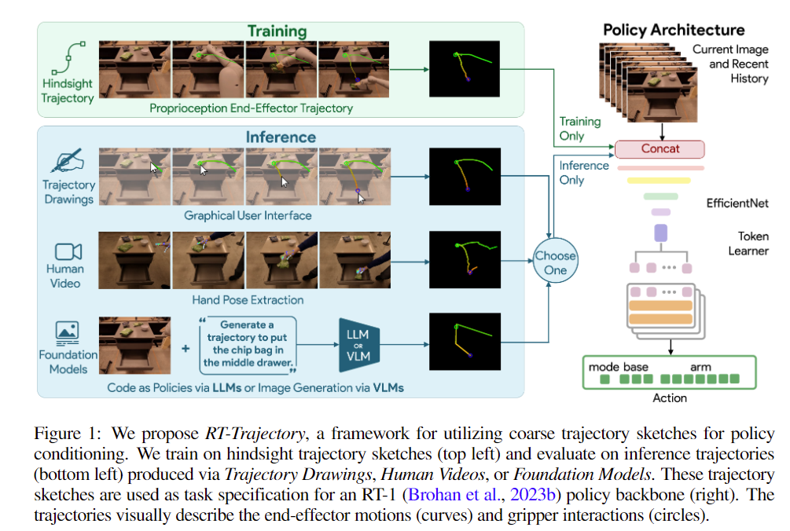 

---
#### RT-Trajectory 模型架构详解


① **图像编码器（Vision Encoder）**

RT-Trajectory 使用 **EfficientNet** 作为图像编码器，将输入的 RGB 图像转换为图像 token。这些图像 token 包含了图像的视觉信息，并将作为 Transformer 的输入。

- **Token 格式**：每个图像被划分成多个 patch，每个 patch 对应一个 token，形状为 `(batch_size, num_patches, embedding_dim)`。


② **轨迹草图编码器（Trajectory Sketch Encoder）**

RT-Trajectory 引入了一个 **2D轨迹草图** 来作为任务的条件输入。草图被用来描述机器人的运动轨迹，通过将其转化为图像 token 来进行编码。

- **Token 格式**：轨迹草图通过图像编码器处理，生成轨迹的 token 序列：
  ```
  [轨迹草图] → [轨迹 token_1, token_2, ..., token_m]
  ```

  轨迹草图可以是人工绘制的，也可以通过其他方法（如视频或自动化工具）生成。


③ **特征融合与位置编码**

将图像 token 和轨迹草图 token 拼接成一个联合序列，形成最终的输入。RT-Trajectory 会为这些 token 添加 **位置编码** 和 **token 类型标记**，使模型能够区分图像和轨迹草图的不同来源。

- **Token 格式**：拼接后的 token 序列形状为：
  ```
  [图像 token_1, ..., token_n] + [轨迹 token_1, ..., token_m] → [联合 token_1, token_2, ..., token_(n+m)]
  ```


④ **多层 Transformer 编码器**

拼接后的联合 token 序列被输入到 **Transformer 编码器** 中。该编码器包含多个自注意力层和前馈网络，负责在图像和轨迹之间建立深层次的联系。

- **输出格式**：Transformer 的输出是一个融合了图像和轨迹信息的 token 序列：
  ```
  [联合 token_1, token_2, ..., token_(n+m)] → [输出 token_1, token_2, ..., token_(n+m)]
  ```


⑤ **动作预测（Action Prediction）**

在 RT-Trajectory 中，动作的生成是基于条件轨迹草图的。通过自回归方式，模型逐步生成动作的 token 序列。

- **Token 生成**：模型逐步生成每个动作的 token，类似语言模型的生成过程：
  ```
  [图像 token] + [轨迹 token] + [动作 token_1, ..., token_i] → [动作 token_{i+1}]
  ```
  每个动作的 token 都对应一个动作的控制值，最终形成一个完整的动作序列。


⑥ **推理过程（Inference）**

推理时，RT-Trajectory 会基于轨迹草图和图像生成动作序列。每生成一个动作 token，都会更新输入并继续生成下一个 token，直到完成整个动作序列。

- **推理格式**：
  ```
  [图像 token] + [轨迹 token] + [动作 token_1, ..., token_i] → [动作 token_{i+1}]
  ```


⑦ **动作解码（Action Decoding）**

生成的动作 token 序列通过解码器映射回连续的控制信号。每个动作的 token 会映射回其对应的动作值。

- **解码格式**：
  ```
  [动作 token_1, token_2, ..., token_k] → [动作值_1, 动作值_2, ..., 动作值_k]
  ```

  生成的 token 序列会还原为实际的控制信号，最终得到机器人执行的动作。


⑧ **总结**

- **输入格式**：
  ```
  [图像 token] + [轨迹 token] → [动作 token_1, token_2, ..., token_k]
  ```

- **生成过程**：
  ```
  [图像 token] + [轨迹 token] + [动作 token_1, ..., token_i] → [动作 token_{i+1}]
  ```

- **解码格式**：
  ```
  [动作 token_1, token_2, ..., token_k] → [动作值_1, 动作值_2, ..., 动作值_k]
  ```
架构利用 **2D轨迹草图** 作为任务条件，并结合 **Transformer** 模型进行任务执行。它通过 **自回归生成** 动作序列，并通过解码生成机器人可执行的动作控制信号，能够处理新的任务，并具备较强的泛化能力。

---

### 4. OpenVLA
- 架构：图像编码（DINOv2）+ LLaMA + token映射动作 → de-tokenizer恢复动作向量
- Action Head：自回归token生成，de-tokenizer将token转为动作。
  


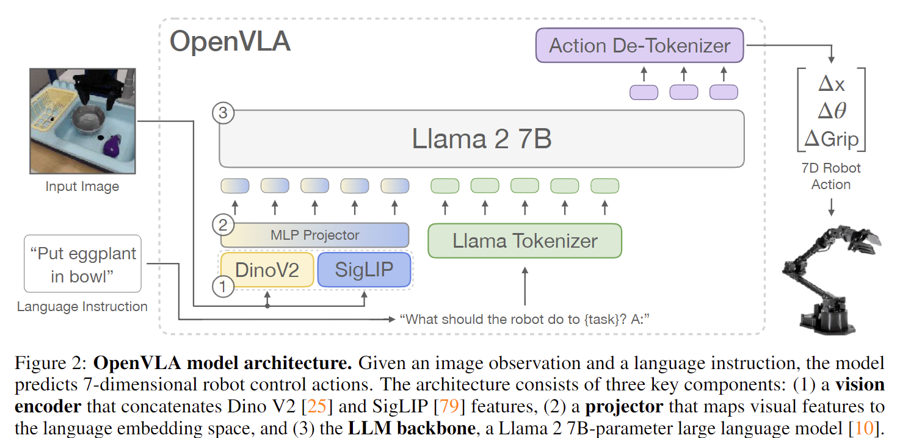 

---

### OpenVLA 模型架构详解

OpenVLA 是一个基于视觉-语言-动作（VLA）的多模态机器人控制模型，其输入包括图像观测和语言指令，输出为7维离散机器人控制动作（如位置、速度等）。该模型通过结合 Llama 2 和视觉编码器，能够处理多个机器人控制任务并支持高效的微调。

① **图像编码器（视觉编码器）**

OpenVLA 使用结合了 **DINOv2** 和 **SigLIP** 视觉编码器的模型。图像输入首先通过这两个预训练的视觉模型进行处理，提取图像的多尺度特征。DINOv2 提供了高层语义信息，而 SigLIP 提供了低层空间特征，它们的特征会被拼接并送入模型。

- **输入格式**：图像经过 DINOv2 和 SigLIP 编码器生成图像 tokens：
  ```
  [图像] → [图像 token_1, token_2, ..., token_n]
  ```

② **语言编码器（语言模型）**

OpenVLA 使用 **Llama 2 7B** 作为其语言模型（LLM）基础，负责将自然语言指令转换为固定长度的语义向量。Llama 2 是一个大规模预训练的语言模型，能够理解并生成自然语言。

- **输入格式**：语言指令经过 Llama 2 编码为 token 序列：
  ```
  [语言指令] → [指令 token_1, token_2, ..., token_m]
  ```

③ **图像和语言特征融合**

将图像 tokens 和语言 tokens 进行拼接，形成一个联合输入序列。为了使 Transformer 理解每个 token 的来源，OpenVLA 会添加位置编码和 token 类型标记，明确区分图像和语言信息。

- **token 格式**：图像 tokens 和语言 tokens 被拼接形成联合序列：
  ```
  [图像 token_1, token_2, ..., token_n] + [指令 token_1, token_2, ..., token_m] → [联合 token_1, token_2, ..., token_(n+m)]
  ```

④ **多层 Transformer 编码器**

拼接后的图像和语言 tokens 被输入到 **Transformer 编码器** 中，进行深层次的信息融合。Transformer 通过多头自注意力机制，能够捕捉图像与语言之间的复杂关系，生成包含图像与语言上下文信息的输出 token。

- **输出格式**：Transformer 输出的 token 序列包含来自图像和语言的信息：
  ```
  [联合 token_1, token_2, ..., token_(n+m)] → [输出 token_1, token_2, ..., token_(n+m)]
  ```

⑤ **动作离散化（Action Discretization）**

OpenVLA 将机器人的控制动作离散化为多个 bins，每个动作维度（如位置、速度等）都被离散化为 256 个 bin，每个 bin 对应一个 token。

- **token 格式**：每个动作维度被离散化为 256 个 token：
  ```
  [动作维度_1] → [动作 token_1, token_2, ..., token_256]
  [动作维度_2] → [动作 token_257, token_258, ..., token_512]
  ```

⑥ **动作头（Action Head）**

OpenVLA 使用多个并行的分类器（每个分类器对应一个动作维度）来预测每个动作的 token。每个分类器输出一个 256 维的概率分布，表示该动作维度的离散化控制值。最终的动作是这些 token 序列的组合。

- **token 格式**：每个动作维度通过分类器输出 256 个 token：
  ```
  [动作 token_1, token_2, ..., token_256] + [动作 token_257, token_258, ..., token_512] → [完整的动作 token 序列]
  ```

⑦ **推理过程（Inference）**

推理时，模型逐步生成动作 token 序列。每一步，模型根据之前生成的动作 token 和当前输入的图像与语言条件预测下一个动作 token。最终，生成的动作 token 序列将被解码为连续的动作值。

- **生成过程**：
  ```
  [图像 token] + [指令 token] + [动作 token_1, ..., token_i] → [动作 token_{i+1}]
  ```
  每一步生成一个新的动作 token，直到生成完整的动作序列。

⑧ **动作解码（Action Decoding）**

生成的动作 token 序列通过解码器被转化为连续的控制信号。每个 token 会根据其对应的离散区间（由 bin 中心表示）进行解码。

- **解码格式**：
  ```
  [动作 token_1, token_2, ..., token_k] → [动作值_1, 动作值_2, ..., 动作值_k]
  ```
  生成的 token 会映射回实际的控制信号，最终得到机器人执行的动作。


---

### 5. TinyVLA
- 架构：轻量LLaMA + 动作条件控制 + diffusion MLP decoder
- Action Head：使用简化diffusion模型直接生成动作。


---


### TinyVLA 模型架构详解

TinyVLA 是一个高效的多模态机器人控制模型，结合了视觉和语言输入，通过 **扩散模型** 生成机器人动作。以下是该模型架构的详细解构，重点放在 **Action Head** 结构。

① **图像编码器（Vision Encoder）**

TinyVLA 使用 **Vision Transformer（ViT）** 作为图像编码器，图像输入首先被划分为若干个 patch，每个 patch 会被编码为一个 token，这些图像 token 被送入后续的模型进行处理。

- **输入格式**：图像通过 ViT 转换为图像 tokens：
  ```
  [图像] → [图像 token_1, token_2, ..., token_n]
  ```

② **语言编码器（Text Encoder）**

TinyVLA 使用 **Pythia** 作为语言模型后端，负责将语言指令转化为固定长度的语义向量。语言模型的输出是一个固定长度的 token 序列，表示该指令的语义信息。

- **输入格式**：语言指令经过 Pythia 编码为 token 序列：
  ```
  [语言指令] → [指令 token_1, token_2, ..., token_m]
  ```

③ **图像和语言特征融合**

TinyVLA 将图像 tokens 和语言 tokens 拼接在一起，形成一个联合输入序列。为了帮助 Transformer 理解每个 token 的来源（图像或语言），TinyVLA 在这些 token 上添加了位置编码或 token 类型标记。

- **token 格式**：拼接后的图像和语言 token 序列：
  ```
  [图像 token_1, token_2, ..., token_n] + [语言 token_1, token_2, ..., token_m] → [联合 token_1, token_2, ..., token_(n+m)]
  ```

④ **扩散策略解码器（Diffusion Policy Decoder）**

TinyVLA 采用 **扩散模型（DDPM）** 来生成控制动作。与传统的自回归模型不同，扩散模型通过逐步去噪生成连续的控制信号，避免了生成过程中误差的积累。

- **输入格式**：生成的动作通过扩散模型进行去噪：
  ```
  [联合 token_1, token_2, ..., token_(n+m)] → [去噪后的动作 token]
  ```

⑤ **Action Head（动作头）**

TinyVLA 的 **Action Head** 使用扩散模型（Diffusion Model）生成控制动作。每个动作的生成是通过去噪过程逐步恢复的，而不是直接使用传统的自回归方法。

- **核心概念**：每个动作维度的离散 token 序列通过扩散模型进行去噪，最终生成连续的控制信号。

- **token 格式**：扩散模型输出的每个动作 token 序列，表示一个动作维度的预测：
  ```
  [图像 token] + [指令 token] → [去噪后的动作 token_1, token_2, ..., token_k]
  ```

⑥ **推理过程（Inference）**

在推理过程中，TinyVLA 从随机噪声开始，通过去噪过程逐步恢复动作 token，并最终还原为控制信号。

- **生成过程**：
  ```
  [图像 token] + [指令 token] + [噪声 token] → [去噪后的动作 token]
  ```

每步生成一个新的动作 token，直到生成完整的动作序列。

⑦ **动作解码（Action Decoding）**

生成的动作 token 序列通过解码器转换为连续的控制信号。每个 token 会根据其对应的离散区间进行解码，最终得到机器人可执行的控制动作。

- **解码格式**：
  ```
  [动作 token_1, token_2, ..., token_k] → [动作值_1, 动作值_2, ..., 动作值_k]
  ```
---

### 6. TraceVLA
- 架构：当前图像 + 轨迹图像（叠加） + 文本 → LLM → token动作输出
- Action Head：与OpenVLA一致，自回归输出token。
  
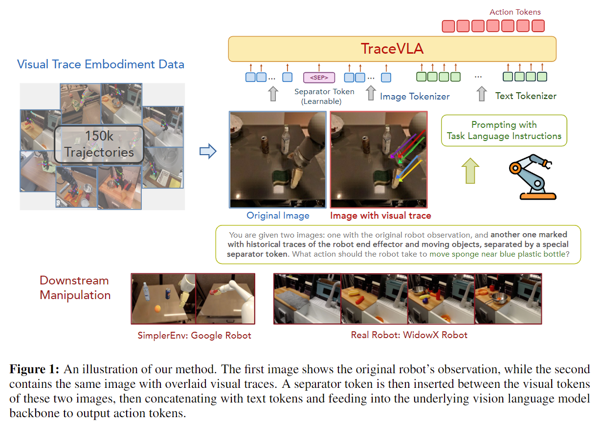

---
#### TraceVLA 模型架构详解

TraceVLA 是一种基于视觉-语言-动作（VLA）架构的机器人控制模型，结合了视觉追踪和空间-时间信息处理，用于增强机器人在复杂任务中的表现，特别是操控任务。

① **图像编码器（Vision Encoder）**

模型首先接收来自机器人摄像头的图像，通过 **Co-Tracker** 提取图像中的关键点轨迹。Co-Tracker 通过在图像中标记关键点并跟踪这些点的位置，生成一个 **visual trace**，即一系列多点运动轨迹。图像被转化为 token 并传递给 VLA 模型。

- **输入格式**：将带有视觉轨迹标记的图像输入视觉编码器，生成视觉 token：
  ```
  [图像] + [视觉轨迹 token_1, token_2, ..., token_n] → [图像 token_1, token_2, ..., token_n] + [视觉轨迹 token_1, token_2, ..., token_m]
  ```

② **语言编码器（Text Encoder）**

与图像输入同步，语言指令被传入一个 **语言模型**（如 PaLM-E），转化为语义向量，用于指引模型在特定环境中执行任务。此部分和图像特征拼接，形成联合的输入。

- **输入格式**：语言输入通过文本编码器生成 tokens：
  ```
  [语言指令] → [指令 token_1, token_2, ..., token_m]
  ```

③ **特征融合与位置编码**

图像 token 和语言 token 被拼接成一个长序列，并通过位置编码标记其类型（图像或语言），以供后续的 Transformer 编码器处理。

- **token 格式**：图像和语言 token 被拼接为：
  ```
  [图像 token_1, token_2, ..., token_n] + [指令 token_1, token_2, ..., token_m] → [联合 token_1, token_2, ..., token_(n+m)]
  ```

④ **多层 Transformer 编码器**

拼接后的联合输入序列被送入多层 **Transformer 编码器** 中。Transformer 通过多头自注意力机制，处理图像和语言之间的复杂关系，生成融合了空间和语言信息的 token。

- **输出格式**：Transformer 输出的 token 融合了来自图像和语言的信息：
  ```
  [联合 token_1, token_2, ..., token_(n+m)] → [输出 token_1, token_2, ..., token_(n+m)]
  ```

⑤ **动作头（Action Head）**

在处理完图像和语言信息后，TraceVLA 利用 **视觉轨迹** 和 **文本指令** 生成控制动作。每个动作维度通过离散化处理并映射为 token，每个动作维度会被分为多个 bins，使用多个分类器来预测每个动作的值。

- **token 格式**：每个动作维度会生成一个 token 序列，表示每个动作的离散值：
  ```
  [动作 token_1, token_2, ..., token_256] → [完整动作 token 序列]
  ```

⑥ **推理过程（Inference）**

推理时，模型基于输入的图像、语言指令和视觉轨迹，逐步生成动作 token。每一步，模型根据之前生成的动作 token 和当前输入的视觉、语言信息预测下一个动作 token。

- **生成过程**：生成一个动作 token 序列：
  ```
  [图像 token] + [指令 token] + [动作 token_1, ..., token_i] → [动作 token_{i+1}]
  ```

⑦ **动作解码（Action Decoding）**

生成的动作 token 序列通过解码器被还原为连续的控制信号。这些 token 会被映射回实际的控制动作值，供机器人执行。

- **解码格式**：生成的 token 序列被解码为实际控制信号：
  ```
  [动作 token_1, token_2, ..., token_k] → [动作值_1, 动作值_2, ..., 动作值_k]
  ```


---

### 7. Octo
- 架构：图像 + 指令输入 → Transformer → readout token → diffusion解码动作chunk
- Action Head：扩散解码器生成动作块（非token）。

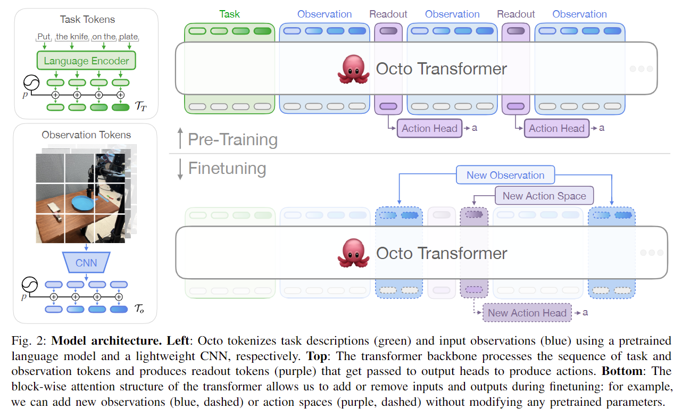

---
#### Octo 模型架构详解

Octo 是一个基于 Transformer 的通用机器人政策，它可以通过微调适应新环境和任务，包括不同的传感器输入和动作空间。Octo 使用了大量来自 **Open X-Embodiment 数据集**的机器人示范数据，并支持语言指令、目标图像以及机器人观测的条件推理。

① **任务和观测 token 化（Task and Observation Tokenization）**

任务定义（如语言指令 ℓ 和目标图像 g）与机器人观测 o 通过特定的 tokenizers 转换成 token：

- **语言输入**：通过预训练的 T5-base 模型将语言指令 token 化，输出语言嵌入的 token 序列。
  ``` 
  [语言指令] → [语言 token_1, token_2, ..., token_m]
  ```

- **图像输入**：通过轻量级 CNN 提取图像特征，将图像划分为若干个 patch，并转换为 token。
  ``` 
  [图像] → [图像 token_1, token_2, ..., token_n]
  ```

这些 token 会被拼接在一起，并加入位置编码，形成输入序列：
```
[任务 token] + [图像 token] → [输入 token_1, token_2, ..., token_k]
```

② **Transformer Backbone**

拼接后的 token 序列输入到 **Transformer** 中，Transformer 负责捕捉图像与语言之间的深层次关系。输出的 token 作为后续生成动作的基础。

- **输出格式**：
  ```
  [输入 token_1, token_2, ..., token_k] → [输出 token_1, token_2, ..., token_k]
  ```

③ **动作解码（Action Decoding）**

Octo 使用 **动作头（Action Head）** 来预测机器人动作。动作头通过条件扩散（diffusion）过程生成动作，输出一组连续的动作值。

- **扩散过程**：
  在训练过程中，Octo 使用扩散模型来预测未来一段时间的连续动作，并通过扩散步骤（包括噪声和解噪）生成每个时间步的动作。这种方法可以生成高精度的连续动作，避免了误差的积累。

  ``` 
  [图像 token] + [指令 token] + [历史动作 token_1, ..., token_i] → [下一个动作 token_{i+1}]
  ```

  生成的动作 token 序列通过解码器映射到具体的控制信号。

- **输出格式**：
  ```
  [动作 token_1, token_2, ..., token_n] → [控制信号_1, 控制信号_2, ..., 控制信号_n]
  ```

④ **灵活的任务和动作空间适应性（Flexible Task and Action Space Adaptation）**

Octo 在预训练时可以处理不同的任务和动作空间，并能在微调时轻松适应新的机器人设置。训练过程中，Octo 通过将任务和观测的输入 token 与动作空间输出 token 的适配性设计，支持多任务训练并生成多模态控制策略。

⑤ **训练与微调（Training and Fine-tuning）**

Octo 在 **Open X-Embodiment 数据集**上预训练，并且能通过简单的微调适应新的机器人任务、环境和动作空间。在微调过程中，Octo 通过调整输入的任务和观测 token，使得模型能够适应新的机器人配置、感知输入和控制信号。

- **微调过程**：
  ```
  [新的任务 token] + [新的观测 token] → [新动作 token_1, ..., new_action_n]
  ```

⑥ **推理过程（Inference）**

在推理时，Octo 逐步生成动作 token，通过每一步生成一个新的动作 token，并将这些生成的 token 序列组合成完整的动作序列。这个过程是条件生成的，每个新的动作 token 都是基于之前生成的 token 和当前输入的图像与语言信息预测出来的。

⑦ **总结**

Octo 是一个通用机器人政策，能够通过语言指令、目标图像和机器人观测灵活适应不同的任务和机器人配置。它利用 Transformer 架构有效融合多模态信息，并通过扩散模型生成高精度的连续动作，广泛适用于多机器人控制任务。

---

### 8. π0
- 架构：图像+语言嵌入 → Transformer → Flow Matching expert → 连续动作
- Action Head：使用flow-matching ODE模块生成动作（非采样）。

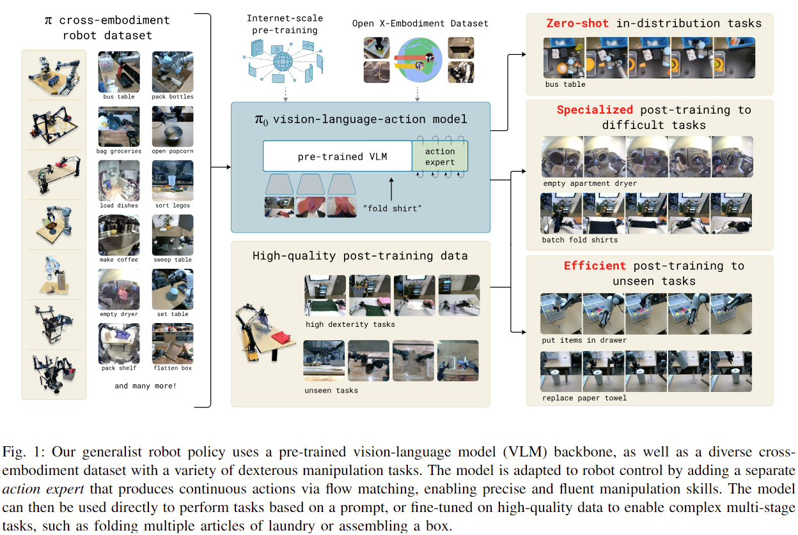

---
### π0 模型架构详解

Pi0 是一个基于视觉-语言-动作（VLA）模型的多模态机器人控制框架，旨在通过视觉和语言输入生成高效的机器人控制动作。该模型通过 **扩散模型**（Flow Matching）进行动作生成，避免了自回归模型中的误差积累问题。以下是 Pi0 模型架构的详细解构：

① **图像编码器（Vision Encoder）**

Pi0 使用 **Vision Transformer（ViT）** 作为图像编码器。输入的图像首先被划分为多个 patch，每个 patch 会生成一个 token，这些 tokens 会通过 ViT 模型处理，最终生成图像的特征表示。

- **输入格式**：图像通过 ViT 转换为图像 tokens：
  ```
  [图像] → [图像 token_1, token_2, ..., token_n]
  ```
  每个 token 代表图像的一个局部区域（patch）。

② **语言编码器（Text Encoder）**

Pi0 使用 **PaliGemma** 作为语言模型（LLM）对语言指令进行编码。PaliGemma 是一个大规模预训练的语言模型，能够将自然语言指令转换为一个固定长度的语义向量，表达语言指令的语义信息。

- **输入格式**：语言指令经过 PaliGemma 编码为 token 序列：
  ```
  [语言指令] → [指令 token_1, token_2, ..., token_m]
  ```
  每个 token 表示语言中的一个单词或子词。

③ **特征融合（Feature Fusion）**

图像 token 和语言 token 被拼接成一个联合序列，并通过位置编码标记其来源（图像或语言）。此步骤帮助 Transformer 理解每个 token 的类型和来源。

- **token 格式**：图像 token 和语言 token 被拼接后，生成联合 token 序列：
  ```
  [图像 token_1, token_2, ..., token_n] + [语言 token_1, token_2, ..., token_m] → [联合 token_1, token_2, ..., token_(n+m)]
  ```

④ **多层 Transformer 编码器（Transformer Encoder）**

拼接后的图像和语言 tokens 被输入到 **多层 Transformer 编码器** 中。Transformer 通过多头自注意力机制，能够捕捉图像和语言之间的复杂关系，生成深度融合的特征表示。

- **输出格式**：Transformer 输出的 token 序列包含了图像和语言信息的融合：
  ```
  [联合 token_1, token_2, ..., token_(n+m)] → [输出 token_1, token_2, ..., token_(n+m)]
  ```

⑤ **动作离散化（Action Discretization）**

Pi0 将机器人控制动作离散化为多个 bins，每个动作维度（如位置或旋转角度）都被离散化为 256 个 bins，每个 bin 对应一个 token。

- **token 格式**：每个动作维度通过分类器输出 256 个 token：
  ```
  [动作维度_1] → [动作 token_1, token_2, ..., token_256]
  [动作维度_2] → [动作 token_257, token_258, ..., token_512]
  ```

⑥ **动作头（Action Head）**

Pi0 的 **Action Head** 使用 **Flow Matching Expert** 来生成机器人控制动作。通过 **扩散过程**（ODE），Flow Matching Expert 逐步去噪并恢复动作的控制值。与传统自回归方法不同，Pi0 通过去噪过程生成连续动作，避免了误差积累问题。

- **生成过程**：每个动作维度的离散 token 序列通过 Flow Matching 技术进行去噪，最终生成连续的控制信号。
  ```
  [图像 token] + [指令 token] + [历史动作 token_1, ..., token_i] → [动作 token_{i+1}]
  ```

- **输出格式**：生成的动作 token 序列会被解码为实际控制信号：
  ```
  [动作 token_1, token_2, ..., token_k] → [动作值_1, 动作值_2, ..., 动作值_k]
  ```

⑦ **推理过程（Inference）**

在推理过程中，Pi0 模型会逐步生成动作 token。每一步，模型根据之前生成的动作 token 和当前的图像与语言输入预测下一个动作 token，直到完成整个动作序列。

- **生成过程**：
  ```
  [图像 token] + [指令 token] + [动作 token_1, ..., token_i] → [动作 token_{i+1}]
  ```
  每一步生成一个新的动作 token，直到生成完整的动作序列。

⑧ **动作解码（Action Decoding）**

生成的动作 token 序列通过解码器转化为连续的控制信号。每个 token 会根据其对应的离散区间（由 bin 中心表示）进行解码，最终得到连续的机器人控制信号。

- **解码格式**：
  ```
  [动作 token_1, token_2, ..., token_k] → [动作值_1, 动作值_2, ..., 动作值_k]
  ```


⑨ **总结**

Pi0 通过图像和语言的多模态信息输入，使用 **Transformer** 进行有效的特征融合。它将机器人控制动作离散化为 token，并通过 **Flow Matching Expert** 逐步去噪生成高精度的连续控制信号。与传统的自回归模型不同，Pi0 在生成过程中避免了误差积累，并能够生成更稳定、精确的动作。

--- 


### 9. CogACT
- 架构：LLM reasoning → Transformer → FiLM注入 reasoning → latent diffusion decoder
- Action Head：扩散动作生成模块，FiLM调控条件嵌入。
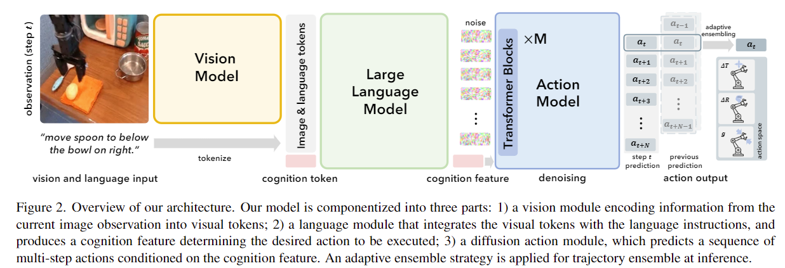

---
### CogACT 模型架构详解

CogACT 是一个基于视觉、语言和动作的联合模型，结合了自回归和扩散模型的特点，用于高效的机器人控制任务。以下是 CogACT 的详细模型架构解构：

① **图像编码器（Vision Encoder）**

CogACT 使用 **SigLIP** 编码器来处理输入的图像。图像通过 SigLIP 编码器提取密集的视觉特征，这些特征会被后续的 Transformer 模型用于生成机器人控制动作。

- **输入格式**：图像通过 SigLIP 编码器转换为图像特征 tokens：
  ```
  [图像] → [图像 token_1, token_2, ..., token_n]
  ```
  每个 token 代表图像的一个局部区域（patch）表示。

② **语言编码器（Text Encoder）**

语言指令使用 **Qwen2-VL**，即一个先进的视觉-语言模型（VLM）进行编码。该模型能够将自然语言指令转换为一个固定长度的语义向量，表达语言指令的深层次语义。

- **输入格式**：语言指令通过 Qwen2-VL 编码为 token 序列：
  ```
  [语言指令] → [指令 token_1, token_2, ..., token_m]
  ```
  每个 token 表示语言中的一个单词或子词。

③ **特征融合与位置编码（Feature Fusion and Positional Encoding）**

图像特征 tokens 和语言指令 tokens 被拼接成一个联合的序列，并通过位置编码（Positional Encoding）标记每个 token 的类型和来源。通过这种方式，Transformer 可以理解每个 token 来自于视觉输入还是语言输入。

- **token 格式**：图像 tokens 和语言 tokens 被拼接成联合序列，包含图像和语言的信息：
  ```
  [图像 token_1, token_2, ..., token_n] + [语言 token_1, token_2, ..., token_m] → [联合 token_1, token_2, ..., token_(n+m)]
  ```

④ **多层 Transformer 编码器（Transformer Encoder）**

图像和语言 tokens 被输入到 **Transformer 编码器** 中。Transformer 通过多头自注意力机制，在视觉信息和语言信息之间进行复杂的交互，从而生成一个融合的 token 序列，包含来自两个模态的上下文信息。

- **输出格式**：Transformer 生成的输出 token 序列包含了图像和语言信息的融合：
  ```
  [联合 token_1, token_2, ..., token_(n+m)] → [输出 token_1, token_2, ..., token_(n+m)]
  ```

⑤ **动作解码器（Action Decoder/ Action Head）**

CogACT 的核心是动作解码器，它采用了 **扩散模型**（Diffusion Model），通过逐步去噪来恢复机器人控制动作。解码器首先生成一系列 token，然后将这些 token 作为条件输入到扩散模型中，通过扩散过程逐步生成控制动作。

- **输入格式**：动作解码器的输入是图像特征和语言特征的融合 token，以及生成的初始动作 token：
  ```
  [图像 token] + [指令 token] → [动作 token_1, token_2, ..., token_k]
  ```

⑥ **推理过程（Inference Process）**

在推理过程中，CogACT 会逐步生成动作 token 序列。每一步，模型根据当前输入的图像和语言信息以及之前生成的动作 token 来预测下一个动作 token。最终，所有生成的动作 token 将被解码为实际的机器人控制信号。

- **生成过程**：
  ```
  [图像 token] + [指令 token] + [动作 token_1, ..., token_i] → [动作 token_{i+1}]
  ```
  每一步生成一个新的动作 token，直到生成完整的动作序列。

⑦ **动作解码（Action Decoding）**

生成的动作 token 序列通过解码器被转化为连续的控制信号。每个 token 会映射到一个离散区间（由 token 编号和 bin 中心表示），从而得到连续的控制动作。

- **解码格式**：
  ```
  [动作 token_1, token_2, ..., token_k] → [动作值_1, 动作值_2, ..., 动作值_k]
  ```

---


### 10. Diffusion-VLA
- 架构：视觉+语言 → LLM推理token → FiLM注入 → Latent Diffusion 生成动作
- Action Head：扩散过程生成动作向量，MLP解码末端输出。

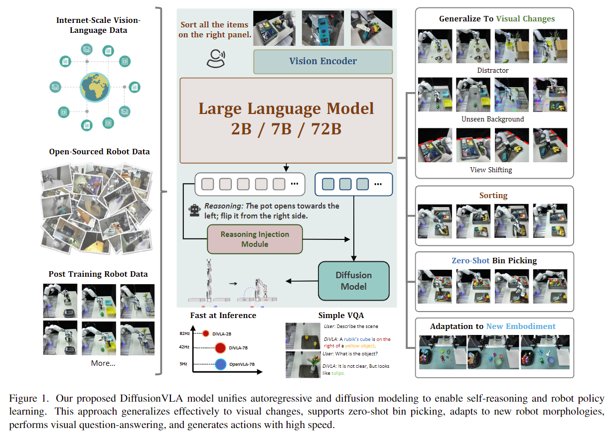

---
### Diffusion-VLA (DiVLA) 模型架构详解

Diffusion-VLA (DiVLA) 是一个将自回归模型与扩散模型相结合的多模态机器人控制框架。其核心思想是将自回归模型用于推理任务，而扩散模型用于控制机器人动作的生成。该方法能够在任务推理过程中提供强大的语言推理能力，同时保持动作生成的鲁棒性。

① **图像编码器（Vision Encoder）**

图像输入首先经过 **SigLIP**（一种视觉编码网络）进行编码，产生紧凑的视觉特征。这些特征随后通过 Transformer 模型进一步处理，生成一系列视觉 token。

- **输入格式**：图像通过 SigLIP 和 Transformer 转换为视觉 tokens：
  ```
  [图像] → [视觉 token_1, token_2, ..., token_n]
  ```

② **语言编码器（Text Encoder）**

DiVLA 使用预训练的 **Qwen2-VL** 语言-视觉模型对语言指令进行编码。该模型将自然语言指令转化为语义丰富的固定长度向量。

- **输入格式**：语言指令被转化为 token 序列：
  ```
  [语言指令] → [指令 token_1, token_2, ..., token_m]
  ```

③ **特征融合与位置编码**

图像 tokens 和语言 tokens 被拼接成一个联合序列，并通过位置编码和 token 类型标记区分图像和语言部分。这样 Transformer 能够理解两种模态的关系，并将其融合。

- **token 格式**：图像和语言 token 被拼接成一个联合序列：
  ```
  [图像 token_1, token_2, ..., token_n] + [指令 token_1, token_2, ..., token_m] → [联合 token_1, token_2, ..., token_(n+m)]
  ```

④ **多层 Transformer 编码器**

拼接后的图像和语言 tokens 被送入多层 **Transformer 编码器**。Transformer 的多头自注意力机制能够捕捉图像与语言之间的复杂关系，生成的输出 token 融合了两种模态的信息。

- **输出格式**：Transformer 输出的联合 token 序列包括图像和语言的上下文信息：
  ```
  [联合 token_1, token_2, ..., token_(n+m)] → [输出 token_1, token_2, ..., token_(n+m)]
  ```

⑤ **动作解码器（Action Decoder）**

DiVLA 使用一个 **扩散模型** 进行动作的生成。扩散模型通过噪声去噪过程逐步生成动作，从而将视觉和语言信息转化为控制信号。具体而言，模型根据生成的 token 来控制机器人的每个动作。

- **动作生成过程**：生成的 token 经过扩散模型的处理后，被转化为连续的动作信号：
  ```
  [视觉 token] + [语言 token] + [动作 token_1, token_2, ..., token_k] → [动作输出]
  ```

⑥ **推理与推断过程（Inference）**

推理时，DiVLA 通过语言和视觉输入预测动作 token，利用扩散模型控制动作的生成。每一步，模型基于当前的图像、语言和之前生成的动作 token 来预测下一个动作 token，直到生成完整的动作序列。

- **推理过程**：
  ```
  [图像 token] + [语言 token] + [动作 token_1, ..., token_i] → [动作 token_{i+1}]
  ```

⑦ **动作解码（Action Decoding）**

生成的动作 token 序列经过解码器还原为连续的控制信号，每个 token 会根据对应的离散区间（由 bin 中心表示）进行解码，最终生成机器人执行的动作。

- **解码格式**：
  ```
  [动作 token_1, token_2, ..., token_k] → [动作值_1, 动作值_2, ..., 动作值_k]
  ```

⑧ **推理增强模块（Reasoning Injection Module）**

为了增强模型的推理能力，DiVLA 引入了推理注入模块。该模块将推理过程的输出嵌入到动作生成的政策网络中，通过 **FiLM**（Feature-wise Linear Modulation）直接调节政策网络的层，从而在生成动作时有效地使用推理信息。

- **推理注入格式**：
  ```
  [推理输出] → [推理增强后的动作输出]
  ```


---

### 11. FAST（π0）
- 架构：图像+语言 → Transformer → 自回归预测压缩后的token序列 → BPE解码 → 频域反DCT
- Action Head：为BPE token解码器，作用于频域动作编码。
  
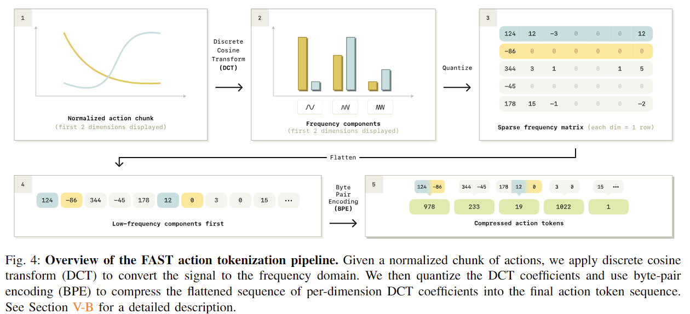

---
### FAST 模型架构详解

FAST 是一种高效的动作 token 压缩方案，专为提升 **自回归型 Vision-Language-Action (VLA)** 模型在高频机器人控制任务中的表现。它通过离散余弦变换（DCT）与 Byte Pair Encoding（BPE）联合实现对动作序列的高效压缩，显著减少 token 数量并提升训练效率。以下是 FAST 模型的详细架构分解：

① **图像编码器（Vision Encoder）**

FAST 通常集成在已有的 VLA 架构中（如 OpenVLA、π⁰）。图像输入通过视觉模型（如 DINOv2、ViT）提取为视觉 token，用于辅助控制条件理解。

- **输入格式**：图像经过编码后生成视觉特征 token：
  ```
  [图像] → [图像 token_1, token_2, ..., token_n]
  ```

② **语言编码器（Text Encoder）**

使用 LLM 结构（如 PaLI-Gemma, Prismatic-7B 等）将自然语言指令编码为 token 序列，作为控制目标的语义条件输入。

- **输入格式**：
  ```
  [语言指令] → [语言 token_1, ..., token_m]
  ```

③ **特征融合与 Transformer 编码器**

将图像和语言 token 拼接输入至 Transformer 模型，通过多层自注意力机制融合多模态信息，生成用于动作预测的上下文特征。

- **联合输入格式**：
  ```
  [图像 token_1, ..., token_n] + [语言 token_1, ..., token_m] → [融合 token_1, ..., token_(n+m)]
  ```

④ **时间序列压缩（Time-Series Compression）**

FAST 的关键创新在于将连续动作序列转换为频域表示：
- 对每个动作维度应用 **离散余弦变换（DCT）**；
- 保留低频成分并丢弃高频噪声；
- 进行量化处理，降低浮点复杂度。

- **步骤**：
  ```
  [动作序列 a1:H] → DCT → 量化 → 稀疏频谱矩阵
  ```

⑤ **BPE 编码压缩（Byte Pair Encoding）**

将 DCT 后的稀疏频谱矩阵展开为整数序列，并通过 BPE 进行压缩，得到最终 token 序列。这些 token 被当作训练目标输入自回归 Transformer 模型。

- **生成过程**：
  ```
  稀疏频谱矩阵 → 展平 + BPE → token_1, token_2, ..., token_k
  ```

⑥ **自回归动作生成（Autoregressive Prediction）**

FAST 保留了标准 Transformer 的 next-token prediction 模式：
- 在训练时以 teacher forcing 预测下一个动作 token；
- 推理时使用贪婪解码或采样逐步生成 token。

- **格式**：
  ```
  [token_1, ..., token_i] → token_{i+1}
  ```

⑦ **反量化与解码（Action Reconstruction）**

解码阶段通过以下流程将 token 还原为动作：
- BPE 解码为 DCT 系数；
- 应用反 DCT 得到连续动作序列；
- 最终输出可执行动作向量 a1:H。

- **格式**：
  ```
  [token_1, ..., token_k] → [DCT 系数] → IDCT → 连续动作 a1:H
  ```

⑧ **训练流程与损失函数**

训练使用标准 **Cross Entropy 损失**，优化自回归模型预测 token 的准确性。

- **损失函数**：
  
  \[
  \mathcal{L} = \sum_{i=1}^{k} \text{CrossEntropy}(\hat{T}_i, T_i)
  \]

⑨ **推理效率与通用性**

FAST 显著减少了每段动作的 token 数量（如原始700个token压缩为50个以内），大幅提升推理效率，训练时间降低至 diffusion 的 1/5，同时保持 comparable 性能。此外，FAST+ 提供了通用 token 编码器，可跨机器人平台泛化使用。


---

### 12. SpatialVLA
- 架构：图像 + 自适应grid → Transformer → 输出3个token（平移/旋转/gripper）
- Action Head：基于grid的多头token输出模块。

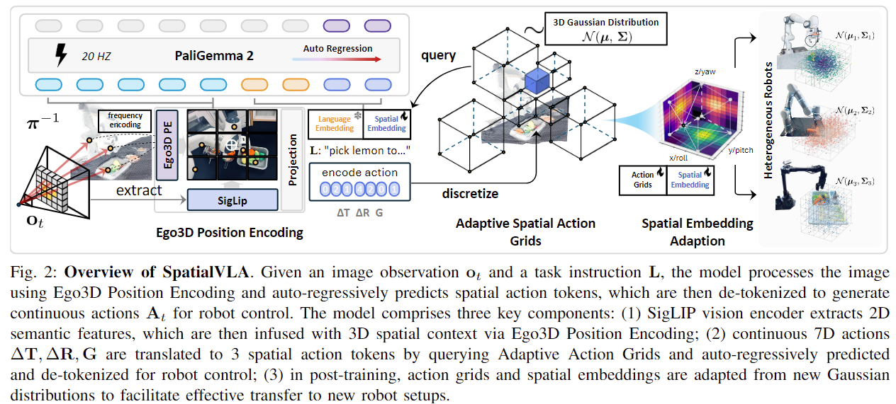

---

### SpatialVLA 模型架构详解

SpatialVLA 是一个多模态机器人控制模型，专注于增强空间感知能力和推理效率。其核心在于 **自适应空间动作网格（Adaptive Spatial Action Grids）**，通过对动作进行高斯建模和离散化，使得模型可以在复杂环境下高效地生成机器人控制动作。以下是 SpatialVLA 模型架构的详细解构：

① **图像编码器（Vision Encoder）**

SpatialVLA 使用 **SigLIP** 作为视觉编码器，将输入的图像转换为一系列视觉特征。图像通过该编码器提取空间特征，帮助模型理解环境中物体的位置和姿态。SigLIP 提供了强大的空间感知能力，使得模型能够在 3D 空间中进行有效的控制。

- **输入格式**：图像通过 SigLIP 编码为视觉特征 token：
  ```
  [图像] → [图像 token_1, token_2, ..., token_n]
  ```

② **Ego3D 位置编码（Ego3D Position Encoding）**

SpatialVLA 使用 **Ego3D 坐标编码**，该编码帮助模型将空间信息与图像特征和动作信息结合。Ego3D 通过对输入的深度信息进行处理，为模型构建一个以机器人为中心的 3D 坐标系，从而增强了空间感知能力。

- **输入格式**：图像特征与深度信息一起被编码为空间 token：
  ```
  [图像特征] + [深度信息] → [空间 token_1, token_2, ..., token_m]
  ```

③ **语言编码器（Text Encoder）**

SpatialVLA 使用 **PaliGemma** 语言模型（如 PaLM-E）将语言指令转化为固定长度的语义向量。该模型能够理解复杂的语言指令，并将其转化为 token 序列，供后续的动作生成使用。

- **输入格式**：语言指令通过 PaliGemma 编码为 token 序列：
  ```
  [语言指令] → [指令 token_1, token_2, ..., token_m]
  ```

④ **特征融合与位置编码**

将图像、深度信息和语言信息结合，形成一个联合输入序列。为了帮助 Transformer 理解不同类型的 token，SpatialVLA 会添加位置编码或 token 类型标记，确保图像、语言和空间信息能够在后续的 Transformer 编码器中得到正确处理。

- **token 格式**：图像、语言和空间信息 token 被拼接成联合序列：
  ```
  [图像 token_1, ..., token_n] + [语言 token_1, ..., token_m] + [空间 token_1, ..., token_k] → [联合 token_1, token_2, ..., token_(n+m+k)]
  ```

⑤ **多层 Transformer 编码器（Transformer Encoder）**

联合 token 序列被输入到 **Transformer 编码器** 中。Transformer 使用多头自注意力机制来捕捉图像、语言和空间信息之间的复杂关系，生成融合后的特征表示。这些特征将作为机器人控制动作的条件输入。

- **输出格式**：Transformer 输出的 token 包含了图像、语言和空间的融合信息：
  ```
  [联合 token_1, token_2, ..., token_(n+m+k)] → [输出 token_1, token_2, ..., token_(n+m+k)]
  ```

⑥ **自适应空间动作网格（Adaptive Spatial Action Grids）**

SpatialVLA 使用 **自适应空间动作网格** 将机器人连续动作（如平移、旋转和抓取）离散化为 token。每个动作维度（例如位置、旋转角度、抓取状态）都会通过高斯建模和离散化，生成相应的 token。

- **动作维度**：模型将每个动作维度的连续值（例如位移、旋转等）离散化为多个区间，每个区间对应一个 token：
  ```
  [平移动作] → [平移 token_1, token_2, ..., token_M]
  [旋转动作] → [旋转 token_1, token_2, ..., token_M]
  [抓取动作] → [抓取 token_1, token_2]
  ```

- 通过 **高斯分布拟合**，每个动作维度（如位置、旋转和夹爪）都被划分为多个离散区间，使得模型能够根据不同的动作分布生成合适的 token。

⑦ **动作头（Action Head）**

**Action Head** 使用 **自适应空间动作网格** 来生成控制动作。每个动作维度的离散 token 序列被送入模型，最终通过 **网格索引** 反推出对应的连续动作值。

- **生成过程**：
  1. 将动作 \((\Delta T, \Delta R, G)\) 转换为 token ID，作为训练目标。
  2. 在推理时，模型输出 3 个 token：平移 token、旋转 token 和抓取 token。
  3. 使用网格索引反推得到连续的动作向量。

- **损失函数**：训练时，采用标准的交叉熵损失计算：
  \[
  \mathcal{L} = \mathbb{E}_{p(A_t|o_t)} [\text{CrossEntropy}(a_t, \tilde{a}_t)]
  \]

⑧ **推理与解码（Inference and Decoding）**

推理时，模型逐步生成动作 token 序列。每一步生成一个新的动作 token，并将这些 token 通过 **网格索引** 还原为连续的动作向量。

- **生成过程**：
  ```
  [图像 token] + [语言 token] + [动作 token_1, ..., token_i] → [动作 token_{i+1}]
  ```

- **解码格式**：
  ```
  [动作 token_1, token_2, ..., token_k] → [动作值_1, 动作值_2, ..., 动作值_k]
  ```

---


### 13. RDT-1B(双臂机器人)
- 架构：图像（多视角） + LLM指令嵌入 + DiT + Alternating Injection → latent diffusion
- Action Head：MLP + latent diffusion chunk解码器（高频控制）。
  
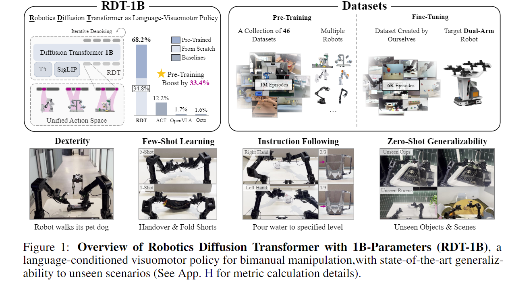

---
### RDT-1B 模型架构详解

RDT-1B 是一款结合了 **扩散建模（Diffusion Modeling）** 和 **MLP 解码器** 的高精度机器人控制模型，专为多模态任务、特别是双臂精细操作任务设计。其独特之处在于使用扩散过程生成控制信号，从而避免了自回归模型中的误差积累问题。

① **图像输入（Image Input）**

RDT-1B 接收三路图像：正面图像、左腕图像和右腕图像，这些图像通过 **SigLIP 编码器** 提取视觉特征。图像经过编码后转化为 token，作为后续操作的基础。

- **输入格式**：图像通过 **SigLIP 编码器** 转换为视觉 tokens：
  ```
  [图像_正面] → [视觉 token_1, token_2, ..., token_n]
  [图像_左腕] → [视觉 token_1, token_2, ..., token_m]
  [图像_右腕] → [视觉 token_1, token_2, ..., token_p]
  ```

② **语言输入（Text Input）**

RDT-1B 使用 **T5-XXL 编码器** 将语言指令转换为语义向量。该语言模型将输入的自然语言指令转化为一个固定长度的 token 序列，作为机器人行为的条件输入。

- **输入格式**：语言指令通过 **T5-XXL 编码器** 转换为 token 序列：
  ```
  [语言指令] → [指令 token_1, token_2, ..., token_m]
  ```

③ **低维输入（Low-dimensional Inputs）**

除了图像和语言输入外，RDT-1B 还接收低维输入数据，主要包括机器人自身的状态信息（如 proprioception）、控制频率和扩散时间步等。这些输入用于提供机器人当前的物理状态，并帮助生成控制动作。

- **输入格式**：
  ```
  [身体状态] + [控制频率] + [扩散时间步] → [低维控制输入 token]
  ```

④ **扩散建模过程（Diffusion Modeling Process）**

RDT-1B 使用 **扩散建模**（Diffusion Model）来生成连续控制信号。扩散过程包括 **前向过程**（向动作序列添加噪声）和 **反向去噪过程**（训练时的目标）。

1. **前向过程（Forward Process）**：向动作序列添加噪声：
   \[
   \tilde{a}_t = \sqrt{\bar{\alpha}_k} a_t + \sqrt{1 - \bar{\alpha}_k} \epsilon
   \]
   
2. **反向去噪（Training Objective）**：
   \[
   \mathcal{L}(\theta) = \mathbb{E}\left[ \left\| a_t - f_\theta(\ell, o_t, \tilde{a}_t, k) \right\|^2 \right]
   \]
   训练的目标是最小化噪声去除误差。

3. **推理阶段（Inference Phase）**：从高斯噪声开始，模型通过多步反向去噪生成动作块（action chunk）。

⑤ **模型结构（fθ）**

RDT-1B 的核心结构是一个 **28 层 Transformer（DiT架构）**，支持图像、语言和动作的多模态交叉注意力（cross-attention）。该结构包括以下关键设计：

- **MLP 解码器（MLP Decoder）**：用于非线性映射，增强模型对复杂物理控制任务的拟合能力。
- **QKNorm + RMSNorm**：解决高频物理量的数值稳定性问题。
- **交替条件注入（Alternating Condition Injection，ACI）**：交替注入图像和语言 tokens，防止注意力偏置。

⑥ **训练与推理流程（Training and Inference Process）**

#### **训练过程**：
- 使用 **DDPM**（Denoising Diffusion Probabilistic Models）训练动作生成模块。
- 使用 **MSE loss** 监督去噪网络训练。
- 图像通过 **SigLIP 编码器**（冻结）进行处理，语言通过 **T5-XXL 编码器**（冻结）进行处理，低维量通过 **带 Fourier 特征的 MLP** 进行编码。

#### **推理过程**：
- 输入图像 + 指令 → 编码后条件。
- 从高斯噪声采样潜在动作，经过 5 步反向扩散生成完整的动作块（action chunk）。
- 控制频率可达到 **381Hz**，能够每秒生成多个动作序列。

⑦ **Action Head：扩散建模 + MLP 解码器**

**Action Head** 使用 **扩散模型**（Diffusion Model）生成动作序列。与传统自回归模型不同，RDT-1B 采用 **扩散建模**，通过逐步去噪的过程生成精确的控制动作，避免了误差的累积。

- **生成过程**：每个动作维度的离散 token 序列通过扩散模型逐步去噪，最终生成连续的控制信号：
  ```
  [图像 token] + [指令 token] + [历史动作 token_1, ..., token_i] → [动作 token_{i+1}]
  ```

- **输出格式**：生成的动作 token 序列会被解码为实际控制信号：
  ```
  [动作 token_1, token_2, ..., token_k] → [动作值_1, 动作值_2, ..., 动作值_k]
  ```

⑧ **推理与解码（Inference and Decoding）**

在推理时，RDT-1B 逐步生成动作 token 序列。每一步，模型根据当前的图像、语言和之前生成的动作 token 来预测下一个动作 token，直到生成完整的动作序列。

- **生成过程**：
  ```
  [图像 token] + [指令 token] + [已生成的动作 token 序列] → [下一个动作 token]
  ```

⑨ **动作解码（Action Decoding）**

生成的动作 token 序列通过解码器还原为连续的控制信号。每个 token 会根据其对应的离散区间（由 bin 中心表示）进行解码，最终生成机器人执行的控制信号。

- **解码格式**：
  ```
  [动作 token_1, token_2, ..., token_k] → [动作值_1, 动作值_2, ..., 动作值_k]
  ```

---


## 五、总结

1. 从离散表示向连续建模过渡：传统RT-1/2的离散策略逐渐被flow/diffusion等连续生成方式取代。
2. 自回归限制被chunk解码替代：Octo、RDT-1B等使用chunk结构避免长序列token生成误差积累。
3. 模块化结构成为主流：CogACT、Diffusion-VLA等将推理模块与动作生成模块解耦，利于泛化。
4. 控制频率成为重要指标：如RDT-1B可达300Hz，已满足工业机器人控制要求。


