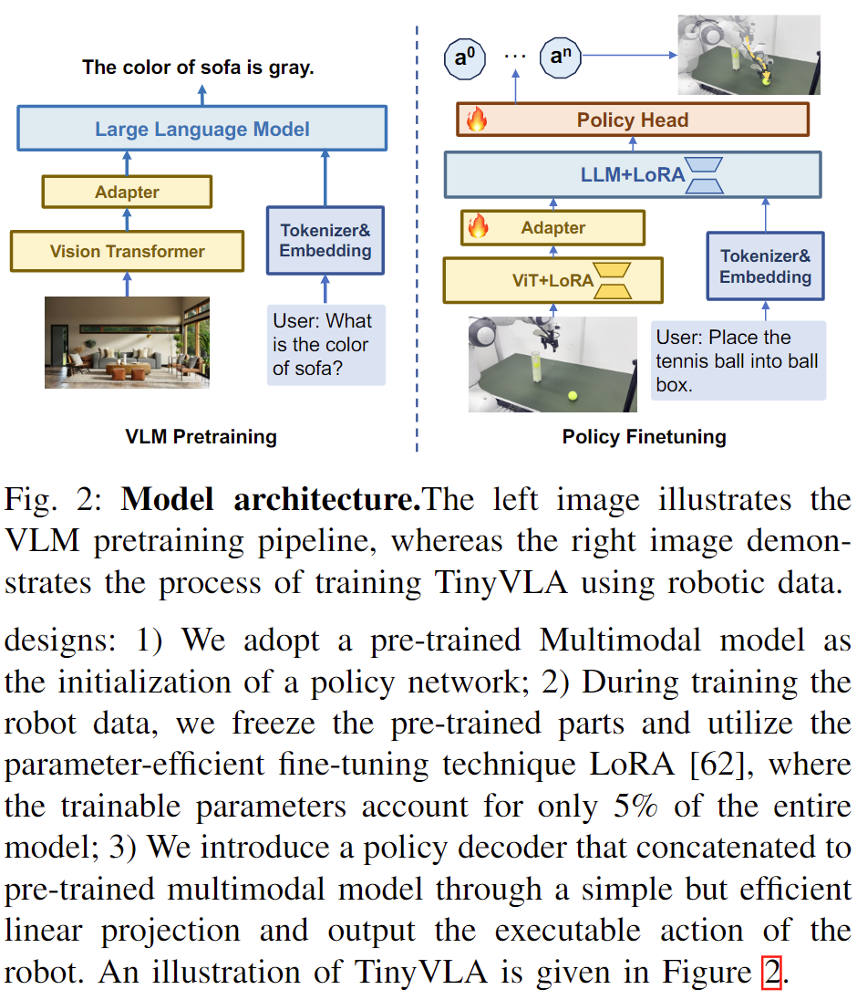

# 具身智能VLA模型中的 Action Head 设计对比调研

参考：https://github.com/TianxingChen/Embodied-AI-Guide

## 一、写在前面——12个模型 Action Head 对比
在本调研中，选取12个VLA模型，对比12个模型中的Action Head设计。在报告中，我将12个模型中的Action Head设计大致分为三大类，分别为多分类器类、自回归类、扩散建模类。
下面两个表格分别为各种action head设计方式的对比表，以及各个模型的详细设计对照表。


---

## 主流 Action Head 设计方式对比表

| **设计主类**        | **子类设计方式**                | **代表模型**                                      | **频率** | **设计核心/机制**                                             | **优点**                                                   | **缺点**                                                   |
|---------------------|-------------------------------|--------------------------------------------------|--------------|-----------------------------------------------------------|-----------------------------------------------------|------------------------------------------------------------|
| **一、多分类器类**   | **多头分类器（维度独立分类）**     | RT-1                                             | 中           | 每个动作维度使用一个分类器，输出bin编号                      | 实现简单，训练稳定，适合多维控制                           | 无法建模时间依赖，控制不连贯，精度有限                    |    
|                     | 草图条件 token 输出            | RT-Trajectory                                    | 中           | 用户绘制轨迹图+观测图送入模型，输出动作token序列，每个动作维度使用一个分类器             | 人机交互友好，可引导轨迹生成                               | 仅限支持图像提示任务                                       |             
| **二、自回归类**     | **离散 token 预测**                | RT-2, OpenVLA, TraceVLA                          | 中高         | 动作离散为token，逐步生成token序列                           | 统一语言-动作token空间，结构简洁，兼容VLM                 | 推理慢，误差积累，不适合高频控制                          |
|                     | Token压缩（频域+BPE）          | FAST（π0附属）                                   | 高           | 动作频域DCT压缩+BPE编码为短token序列                         | 推理速度极快，token数大幅减少，压缩率高                   | 压缩损失可能影响极端精度；需可逆设计                      |
|                     | 动作网格离散（空间token）      | SpatialVLA                                       | 高           | 预定义空间网格+每帧输出3个token（平移、旋转、gripper）        | 空间感知强，token效率极高                                 | 需统计先验分布，灵活性差                                  |
| **三、扩散建模类**   | **标准扩散（DDPM）**               | Octo, CogACT, Diffusion-VLA, TinyVLA             | 高           | 使用多步扩散生成连续动作向量，支持chunk输出                  | 高精度、高表达力，chunk生成，支持非自回归控制             | 推理慢，训练成本高，扩散过程复杂                         |
|                     | **Flow Matching（ODE建模）**       | π0                                               | 高           | 学习动作向量场，使用欧拉积分从初始噪声生成动作                | 速度快，接近扩散质量但更高效                               | 积分路径与训练范数要求高                                |
|                     | Reasoning-Injection扩散        | CogACT, Diffusion-VLA                            | 高           | 先用LLM进行任务推理，reasoning token 作为扩散输入条件         | 可解释性好，语义控制强，适合多阶段复杂任务                | 模块解耦多，训练成本高，对任务规划依赖高                  |

- 文章后续会详细分析多分类方式中的**多分类器**、自回归方式中的**离散token预测**以及扩散建模方式中的**DDPM**与**FLOW MATCHING**建模方式。

---


## 12种模型的 Action Head 设计方式对比表
| 模型         | Action Head             | 是否自回归 | 是否使用扩散 | 控制频率 | token 数 | 特点简述                              |
|--------------|--------------------------|--------------|----------------|------------|-------------|---------------------------------------|
| RT-1         | 多分类器（11维）         | 否           | 否             | 中         | 11         | 并行输出，结构简单                    |
| RT-2         | 离散token自回归          | 是           | 否             | 中         | 7-8        | 与语言token统一                       |
| RT-Trajectory| 多分类器（8维） | 是         | 否             | 中         | 8         | 支持用户可绘制控制                    |
| OpenVLA      | 离散token（映射VLM空间）  | 是           | 否             | 中         | 7          | 与RT-2相似，支持LoRA量化              |
| TinyVLA      | Diffusion Policy（简化）  | 否           | 是             | 高         | 无         | 单步输出，极速推理                    |
| TraceVLA     | 离散token + 轨迹提示     | 是           | 否             | 高         | 7          | 提高空间-时间理解                     |
| Octo         | Diffusion + Chunk Decoder | 否           | 是             | 高         | 无         | 支持长序列chunk输出                   |
| π0           | Flow Matching      | 否           | 是             | 高         | 无         | 较快推理速度，支持动作连贯建模       |
| CogACT       | Diffusion Head  | 否           | 是             | 高         | 无         | 解耦推理与控制模块，具可解释性       |
| Diffusion-VLA| Latent Diffusion | 否        | 是             | 高         | 无         | Reasoning token引导控制               |
| FAST（π0）         | DCT压缩 + BPE token       | 是           | 否             | 高         | 30-60      | token效率最优，自回归但推理极快      |
| SpatialVLA   | Adaptive Grid token       | 是           | 否             | 高         | 3          | 空间感知强，低token数                 |


## 二、Action Head的定义
Action head的命名在业界似乎不太一致。模型如Octo，在论文中有明确提到action head模块；但是其他的模型如π0等，虽然有类似的功能模块，但是没有明确命名为action head模块（文章中定义了一个action expert模块，实现的功能类似于Octo种的action head模块）；也有模型如RT-2，在论文中并没有明确定义为action head模块，而是直接将transformer模块中的输出映射到token空间，作为控制指令输出，也同样实现了类似的功能。

在论文[A Survey on Vision-Language-Action Models for Embodied AI](https://arxiv.org/abs/2405.14093)中，作者在文中提出了一套通用的VLA模型架构，主要由六个核心模块构成（详见下图）：


- 视觉编码器（Vision Encoder），如ViT、SAM等，用于提取图像特征；
- 语言编码器（Language Encoder），如BERT、PaLM等，用于理解自然语言指令；
- 融合模块（Multimodal Fusion）负责将视觉与语言信息进行联合建模；
- 动作解码器（Action Decoder / Policy）用于根据融合后的表示生成机器人可执行的控制指令；
- 世界模型（World Model）用于模拟环境中的状态转移与反馈，辅助模型进行任务规划与预判；
- 推理模块（Reasoning Module）则支持多阶段决策过程，能够实现类似Chain-of-Thought的推理策略，从而增强模型的认知与规划能力。
  
在此报告中，**Action Head的功能与Action Decoder功能类似**，故我们将action head模块粗略的定义为：**模型中负责接收Vision与Language融合表示并输出控制指令的关键模块。**
具体而言，Action Head 的任务是将多模态感知（如图像、文本指令、历史观测等）的输出转换为机器人可执行的连续控制信号（如位置、姿态、夹爪开合等）。
一个设计良好的 Action Head 不仅能够表达足够复杂的控制策略，还需保证推理速度、可泛化能力和高精度输出。在实践中，Action Head 的设计方式对整个VLA模型的实用性有决定性影响。


## 三、常见 Action Head 设计方式与原理解析

### 1. 多分类器（RT-1）
将每个控制维度离散为固定bin数（如256），每个维度设置一个分类器。模型以并行方式输出11个分类结果（对应于机械臂7自由度+底盘3维度+模式切换）。

**优点：** 实现简单、训练稳定，适合大规模数据。
**缺点：** 无法建模动作之间的时间连贯性，对于精细控制不够表达力。

#### 以RT-1为例
- 代码未公开
  
RT-1 中的多分类器（multi-class classifier）实现方式，是将机器人每个控制维度的连续动作值离散化成固定数量的 bins（通常是 256 个），然后对每个维度分别使用一个独立的 softmax 分类器进行预测。总共输出 11 个分类结果，分别对应于 7 个机械臂自由度（通常是 end-effector 的 position + rotation）、3 个底盘运动维度（x、y 速度和角速度），以及一个模式切换（如打开/关闭夹爪）。这样做的好处是可以把连续动作空间转换成离散 token，从而使动作生成任务与语言生成任务结构一致，统一到“下一个 token”的预测框架中，方便使用类似语言模型的 transformer 架构。具体实现中，训练时每个维度都会有一个交叉熵损失，所有维度的 loss 相加即为总的动作预测损失。模型在推理时会为每个维度独立预测一个类别 index（即 bin 编号），然后通过查表或插值还原为连续动作值，最终组成完整的控制指令。这种设计允许高效地并行预测多个维度，同时避免高维连续回归带来的不稳定性或精度下降问题。

### 2. 自回归 token 预测（RT-2, OpenVLA 等）
将连续动作离散为 token，每次预测一个 token，类似语言生成。多个 token 拼接成完整动作序列。

**优点：** 可与语言模型统一架构整合，支持多模态条件推理。
**缺点：** 推理速度慢、误差积累严重、不适合高频控制场景。

#### 以OpenVLA为例
- 代码：https://github.com/openvla/openvla **action head**位于`prismatic/vla/action_tokenizer.py`


① **自回归 token 预测任务**  
OpenVLA 将机器人动作预测建模为一个自回归 token 预测任务：将连续动作离散为 token，并用语言模型按“下一个 token”的方式逐步生成这些 token。每个 token 表示动作的一维或一部分，多个 token 拼接成完整的动作。


② **动作离散化方式**  
在 `ActionTokenizer` 中，连续动作范围（默认是 [-1, 1]）会被均匀分成 256 个 bin。以 NumPy 实现如下：
```python
self.bins = np.linspace(min_action, max_action, self.n_bins)
```
然后用 `np.digitize()` 将动作值转成 bin 编号。每个编号表示该维度动作落在某个区间内，例如 bin 128 表示动作值落在中间区间附近。


③ **token 映射策略**  
为了和语言模型词表对接，OpenVLA 不扩展词表，而是用词表中**最少使用的末尾若干个 token**来表示动作 bin。映射方式如下：
```python
token_id = tokenizer.vocab_size - discretized_bin
```
例如，如果 vocab size 是 32000，那么 bin 1~256 就映射为 31744~31999 的 token ID。


④ **模型训练过程**  
训练时输入是图像 token + 指令 token，目标是生成动作 token 序列。形式如下：
```
[图像 token] + [指令 token] → [动作 token_1, token_2, ..., token_k]
```
训练目标是标准的语言建模目标：预测下一个 token，使用交叉熵损失。整个训练过程就是在做条件语言建模，只不过目标 token 是离散化后的动作。


⑤ **推理过程**  
推理时，模型会像语言模型生成句子一样，逐步生成动作 token：
- 每一步预测当前 token 的概率分布（vocab 上的 softmax）
- 取最大概率（或采样）作为输出 token
- 累积生成所有动作 token，最终拼接还原动作序列

生成后的 token 序列再通过 `decode_token_ids_to_actions()` 映射为连续动作向量，供机器人执行。


⑥ **token 解码为动作值**  
解码函数核心逻辑如下：
```python
discretized_actions = vocab_size - token_ids
discretized_actions = np.clip(discretized_actions - 1, 0, 254)
action_value = bin_centers[discretized_actions]
```
其中 `bin_centers` 是每个离散区间的中心值，代表实际控制信号，最终还原为连续动作。


### 3. 扩散建模（DDPM, Flow-Matching）
采用DDPM或Flow Matching框架，在动作空间中逐步还原无噪声动作。典型如 Octo、π0、CogACT、RDT-1B。

**优点：** 表达力强，能建模动作序列的多样性和平滑性，支持chunk输出。
**缺点：** 训练和推理成本高，需调节扩散步数和学习率，对数值稳定性有要求。

#### 以Octo和π0为例
#### Octo —— DDPM
- 代码：https://github.com/octo-models/octo **action head**位于`octo/model/components/action_heads.py`

 ① **核心思想：扩散建模恢复动作**

Octo 中的 Diffusion Action Head 使用扩散模型（DDPM）进行动作建模。目标是通过逐步去噪，从噪声中恢复出真实动作。每个时间步，模型通过预测去噪误差（\( \epsilon_\theta \)），并应用噪声调度来还原动作。

 ② **训练阶段：加噪动作与损失计算**

在训练阶段，给真实动作加噪并学习预测噪声：

```python
# 加噪动作
A_τ = sqrt(τ) * noise + sqrt(1 - τ) * actions
u_τ = noise - actions  # 目标是去噪

# 计算损失
loss = jnp.mean(jnp.square(pred_eps - u_τ))
```

- `τ` 为噪声调度参数，控制噪声水平。
- `pred_eps` 为模型预测的噪声。

 ③ **推理阶段：去噪过程（采样动作）**

推理时，从标准高斯噪声开始，通过扩散过程逐步去噪，生成最终动作：

```python
# 初始化噪声
noise = jax.random.normal(key, shape)
# 扩散过程
for t in range(diffusion_steps):
    eps_pred = model(noisy_actions, time=t)
    noisy_actions = noisy_actions - eps_pred * scale_factor
```

每步更新噪声，通过 `model()` 预测去噪，并逐步还原动作。

 ④ **关键方法：生成动作**

最终通过去噪步骤生成完整的动作序列：

```python
# 扩散采样
actions = sample_from_diffusion_model(transformer_outputs, noise)
```

模型输出的是每个时间步的动作，最终得到动作序列。


⑤ **总结**

Octo 的 Diffusion Action Head 通过扩散过程学习从噪声中恢复动作，采用条件扩散模型逐步去噪生成动作。训练时加入噪声，推理时通过扩散采样生成动作，适合高精度控制任务。


#### π0 —— Flow-Matching
- 代码：https://github.com/Physical-Intelligence/openpi **action head**位于`src/openpi/models/pi0.py`


① **训练阶段：学习 denoising 向量场**

- 对 ground-truth 动作 `actions` 加噪得到：
  ```python
  A_τ = sqrt(τ) * noise + sqrt(1 - τ) * actions
  u_τ = noise - actions
  ```
- 嵌入方式：动作 `A_τ` 和时间 `τ` 拼接后送入 MLP，构造 token：
  ```python
  time_emb = posemb_sincos(τ)
  action_token = MLP([A_τ, time_emb])
  ```
- 送入 transformer，输出向量场预测：
  ```python
  v_θ = transformer([prefix, action_token])
  loss = mean((v_θ - u_τ)²)
  ```


② **推理阶段：欧拉积分还原动作**

- 初始化高斯噪声动作：
  ```python
  x₀ ∼ N(0, I)
  τ = 1.0
  ```
- 每步向前积分：
  ```python
  v_t = model(x_t, τ)
  x_{t+1} = x_t + dt * v_t
  ```
- 共 10 步，最终 `x₀` 为生成动作。


③ **总结**

π0 将动作看作连续变量，在训练中学习从噪声还原动作的向量场（Flow Matching），在推理中用前向积分一步步生成动作，具备高效、高频、非自回归控制能力。


  


## 四、VLA整体模型架构概览

在VLA模型中，Action Head 并不是独立存在的模块，而是位于整体系统架构的末端，紧接在以下几类模块之后：

1. **视觉编码器（Visual Encoder）**：如DINOv2、SigLIP、ViT，提取图像特征。
2. **语言模型（Language/Multimodal Model）**：如PaLI-X, PaLM-E, LLaMA, Qwen-VL，理解指令或多模态对话。
3. **决策推理模块（Reasoning Module）**：如CogACT、Diffusion-VLA中使用LLM reasoning token；RT-Trajectory使用草图轨迹。
4. **控制解码器（Action Decoder / Head）**：将前面全部信息映射为连续控制指令。

下面逐一拆解12个模型的整体结构，并指出 Action Head 所在的位置：

### 1. RT-1
- 架构：图像编码器（EfficientNet）+ 任务指令嵌入（USE）+ 多层Transformer → 多分类器
- Action Head：位于输出末端，逐维输出动作分类。
  

 


---


#### RT-1 模型架构详解

RT-1 是一个以 Transformer 为核心的多模态机器人控制模型，其输入为语言指令和图像观测，输出为一系列离散的控制动作。每个动作维度由单独的分类器进行预测，最终得到完整的动作向量。

① **图像编码器（EfficientNet）**

RT-1 使用 **EfficientNet** 来处理图像输入，首先通过预训练的 **EfficientNet-B3** 模型对图像进行编码，提取图像特征。该图像编码器输出一个形状为 9x9x512 的特征图。

- **输入格式**：图像经过 EfficientNet 编码生成图像 tokens：
  ```
  [图像] → [图像 token_1, token_2, ..., token_81]
  ```
  每个 token 表示图像的一个局部区域（patch）。

② **语言指令编码器（Universal Sentence Encoder, USE）**

RT-1 使用 **Universal Sentence Encoder（USE）** 对语言指令进行编码，将自然语言转化为固定长度的语义向量。该语义向量与图像特征向量进行结合，用于指导模型生成控制动作。

- **输入格式**：语言指令经过 USE 转化为 token 序列：
  ```
  [语言指令] → [指令 token_1, token_2, ..., token_m]
  ```
  每个 token 表示语言中的一个单词或子词。

③ [**FiLM 层条件化**](#sectionFiLM)

图像 token 和语言 token 被结合在一起，通过 [**FiLM（Feature-wise Linear Modulation）**](#sectionFiLM) 层对图像编码器进行条件化，使得图像特征与语言指令关联，从而加强模型对任务的理解。FiLM 层允许图像特征在语言指导下得到调整。

④ [**TokenLearner**](#sectionTokenLearner)

为了进一步压缩 token 的数量并加速推理，RT-1 使用了 [**TokenLearner**](#sectionTokenLearner) 模块。这一模块通过学习对图像 token 进行选择性筛选，从而仅保留对当前任务最重要的图像信息。这减少了 Transformer 编码器的计算负担。

- **输出格式**：通过 TokenLearner 模块，RT-1 只保留 8 个视觉 token：
  ```
  [图像 token_1, ..., token_81] → [token_1, token_2, ..., token_8]
  ```

⑤ **Transformer 编码器**

经过 TokenLearner 精简后的图像 token 和语言 token 被拼接，输入到 **Transformer 编码器** 中。Transformer 模型由多个自注意力层组成，能够捕捉图像与语言之间的复杂关系。最终输出的 token 表示了图像和语言模态之间的融合信息。

- **输入格式**：拼接后的图像和语言 token 输入到 Transformer 编码器：
  ```
  [图像 token_1, ..., token_8] + [语言 token_1, ..., 语言token_m] → [输出 token_1, ..., token_(8+m)]
  ```

⑥ **动作离散化（Action Discretization）**

RT-1 将每个动作维度离散化为 256 个 bins。每个动作维度的离散化动作被视作一个独立的分类问题，采用分类器预测每个动作维度的离散值。

- **token 格式**：每个动作维度通过分类器输出 256 个 token：
  ```
  [动作维度_1] → [动作 token_1, token_2, ..., token_256]
  [动作维度_2] → [动作 token_257, token_258, ..., token_512]
  ......
  ```

⑦ **动作头（Action Head）**
(不难看出RT-1的Action Head并不是一个独立的模块，是隐含在Transformer编码器中的)
Transformer 输出的 token（特别是图像 token）通过多个并行的分类器进行预测，每个分类器负责预测一个动作维度的离散化值。最终模型输出 11 个动作维度的预测结果。

- **输出格式**：每个动作维度通过分类器输出 256 个 token，最终拼接成完整的动作序列：
  ```
  [动作 token_1, token_2, ..., token_256] + [动作 token_257, token_258, ..., token_512] → [完整的动作 token 序列]
  ```

⑧ **推理过程（Inference）**

推理时，模型逐步生成动作 token 序列。每个时间步，模型基于已经生成的动作 token 和当前图像、语言信息预测下一个动作 token。最终生成的动作 token 序列会通过解码还原为连续的控制信号。

- **生成过程**：
  ```
  [图像 token] + [指令 token] + [动作 token_1, ..., token_i] → [动作 token_{i+1}]
  ```
  每一步预测一个新的动作 token，直到生成完整的动作序列。

⑨ **动作解码（Action Decoding）**

生成的动作 token 序列通过解码器被转化为连续的控制信号。每个 token 根据其对应的离散区间进行解码，最终得到机器人可执行的控制信号。

- **解码格式**：
  ```
  [动作 token_1, token_2, ..., token_k] → [动作值_1, 动作值_2, ..., 动作值_k]
  ```

RT-1 通过将图像、语言和动作任务视为序列建模问题，采用 Transformer 进行处理。通过将动作离散化为 token 序列，RT-1 能够高效地执行控制任务，并展现出强大的零-shot 泛化能力。这一架构使得 RT-1 能够在多任务、跨模态的环境中实现实时机器人控制。

---


### 2. RT-2
**核心思想：将大规模预训练的视觉-语言模型直接整合到低层机器人控制中，从而提升泛化能力并实现语义推理能力的涌现**
- 架构：图像编码器 + LLM backbone（PaLI-X, PaLM-E）+ 动作token输出
- Action Head：token自回归生成动作，动作与语言共用词表。

RT-2 的研究目标是将基于互联网上大规模数据训练的视觉-语言模型，直接迁移用于机器人控制任务。
其核心创新在于：

- 将动作表示为文本 token，统一语言与动作的训练格式；

- 联合微调（co-fine-tuning）：同时在机器人轨迹数据与视觉语言任务上训练；

- 避免重新设计模型架构，直接在强大的视觉-语言预训练模型基础上微调；

- 实现语义泛化能力和推理能力的涌现，例如理解图标、数字、相对关系、甚至执行多步骤规划。

 

---

#### RT-2 模型架构详解

① **图像编码器（Vision Encoder）**

RT-2 使用 **Vision Transformer（ViT）** 编码图像输入。图像首先被划分为固定大小的 patch，再转换为一系列图像 token，表示图像中各局部区域的特征。

- **输入格式**：
  ```text
  [图像] → [图像 token_1, ..., 图像 token_n]
  ```


② **语言编码器（Text Encoder）**

RT-2 使用预训练语言模型（如 PaLM-E 或 PaLI-X）编码自然语言指令，将其转化为 token 序列，表示指令的语义信息。

- **输入格式**：
  ```text
  [指令] → [语言 token_1, ..., 语言 token_m]
  ```

③ **特征融合与位置编码**

图像 token 与语言 token 被拼接成一个统一的序列，送入 Transformer 编码器。RT-2 使用**位置编码**与**类型嵌入（Modality Type Embedding）**标识每个 token 的来源（图像或语言）。

- **拼接格式**：
  ```text
  [图像 token_1, ..., token_n] + [语言 token_1, ..., token_m] → [融合 token_1, ..., token_{n+m}]
  ```

④ **多层 Transformer 编码器**

联合的 token 序列经过多层 Transformer 编码器处理，通过多头自注意力机制学习图像与语言之间的深层语义交互。

- **输出格式**：
  ```text
  [融合 token_1, ..., token_{n+m}] → [表示 token_1, ..., token_{n+m}]
  ```


⑤ **动作离散化（Action Discretization）**

RT-2 将连续的机器人控制动作（如位置、角度、夹爪张合）**离散化为固定区间的 token**。每个动作维度被划分为 256 个 bin，每个 bin 映射为一个独立 token。

- **离散化结果**：
  - 总共有 8 个动作维度（如 3 轴平移、3 轴旋转、夹爪、终止指令）；
  - 每个维度使用 1 个 token，最终动作表示为：
    ```text
    [动作 token_1, ..., 动作 token_8]
    ```


⑥ **动作头（Action Head）**

RT-2 的动作输出部分由 **8 个并行分类器（每个对应一个动作维度）**组成。每个分类器从共享的 Transformer 输出中提取相应 token 表示，并预测 256 个 bin 的概率分布。

- **输出格式**：
  ```text
  每个分类器输出 1 个 token ∈ {0, ..., 255}
  → 最终动作 token 序列 = 8 个 token
  ```


⑦ **推理过程（Auto-regressive Inference）**

推理阶段，RT-2 采用**自回归生成（auto-regressive decoding）**策略：模型根据当前图像、语言输入以及已生成的动作 token 逐步预测下一个动作 token，直到输出完整的动作序列。

- **生成过程**：
  ```text
  [图像 token] + [语言 token] + [已生成动作 token] → [下一个动作 token]
  ```


⑧ **动作解码（Action Decoding）**

最终的动作 token 序列会根据各 bin 对应的中心值映射回连续控制量，得到实际的机器人控制信号。

- **解码格式**：
  ```text
  [动作 token_1, ..., token_8] → [连续动作值_1, ..., 值_8]
  ```

--- 


### 3. RT-Trajectory
- 架构：轨迹草图图像 + 当前观测图像 + Transformer → 输出连续动作向量
- Action Head：为transformer输出层，直接预测动作（非token化）。

 

---

#### RT-Trajectory 模型架构详解

① **图像编码器（Vision Encoder）**  
RT-Trajectory 使用 **EfficientNet-B3（ImageNet预训练）** 作为图像编码器。模型输入为 **连续6帧的RGB图像**，用于构建上下文信息。

- 输入格式：
  ```text
  [xₜ₋₅, xₜ₋₄, ..., xₜ]，共6帧RGB图像（每帧尺寸 H×W×3）
  ```

② **轨迹草图作为条件输入（Trajectory Sketch Conditioning）**  
轨迹草图以图像形式表示，并与RGB图像**在通道维度拼接**，形成一个多通道图像输入（非独立token序列）。

- 拼接格式：
  ```text
  图像输入形状：(H, W, 3)，轨迹草图形状：(H, W, 3)
  所有图像在通道维度拼接：6帧图像 → 18通道，轨迹草图 → 3通道，最终输入为 21 通道图像。
  拼接后输入形状：(H, W, 21)，送入EfficientNet
  ```

- 为支持草图输入，EfficientNet 的第一层卷积增加了输入通道，并将新增通道权重初始化为全零。

③ **Transformer 策略编码器（Transformer Policy Encoder）**  
图像编码器输出的特征序列输入到一个 **Transformer** 中，生成用于策略预测的高维语义表示。

- Transformer 提取图像+草图融合特征，构建时序上下文。

④ **动作预测（Action Prediction Head）**  
RT-Trajectory 将动作离散为 8 个维度（7个末端执行器自由度 + 1个终止动作），每个维度使用一个独立的 **256类 softmax 分类器**。

- 非自回归，**一次性输出完整动作 token 序列**：
  ```text
  输出: [a₁, a₂, ..., a₈]，其中每个 aᵢ ∈ {0, ..., 255}
  ```

⑤ **动作解码（Action Decoding）**  
动作 token 映射回连续控制值（如位置、角度），通过查表或bin中心反量化得到真实控制信号。

- 解码格式：
  ```text
  [a₁, ..., a₈] → [Δx, Δy, Δz, Δroll, Δpitch, Δyaw, gripper, done]
  ```


---

### 4. OpenVLA
- 架构：图像编码（DINOv2）+ LLaMA + token映射动作 → de-tokenizer恢复动作向量
- Action Head：自回归token生成，de-tokenizer将token转为动作。
  


 

---

#### OpenVLA 模型架构详解

OpenVLA 是一个基于视觉-语言-动作（VLA）的多模态机器人控制模型，其输入包括图像观测和语言指令，输出为7维离散化的机器人控制动作。该模型结合了 Llama 2 语言模型与多尺度视觉编码器，支持多机器人通用控制任务，并具备参数高效的微调能力。

① **视觉编码器（Vision Encoder）**

OpenVLA 采用了融合 **DINOv2** 与 **SigLIP** 的双视觉编码器架构。图像首先通过两个独立的预训练编码器分别提取高层语义特征（DINOv2）与低层空间细节（SigLIP），随后将两者的输出在通道维度拼接形成最终图像特征。

- **输入格式**：
  ```text
  图像 → SigLIP特征 + DINOv2特征 → 拼接后图像 token 序列
  ```

② **语言编码器（LLM）**

OpenVLA 使用 **Llama 2-7B** 作为语言模型主干，将自然语言任务指令编码为 token 序列，并在视觉引导下生成控制动作。

- **输入格式**：
  ```text
  指令文本 → tokenizer → 语言 token 序列
  ```

③ **视觉与语言融合**

图像特征经过投影映射器（MLP Projector）转换到 LLM 的输入空间后，与语言 token 序列拼接，作为 LLM 的输入。Transformer 编码器利用自注意力机制对联合序列进行深度交互建模，实现跨模态对齐与融合。

- **融合格式**：
  ```text
  [视觉 token_1, ..., token_n] + [语言 token_1, ..., token_m] → 联合输入序列
  ```

④ **自回归动作生成**

OpenVLA 将动作生成建模为一个 **语言建模任务**。每个动作维度被离散化为 256 个 bin，整个动作向量（如7维）被表示为长度为 N 的离散 token 序列（每个值 ∈ [0, 255]）。这些 token 作为语言模型输出词表的一部分，自回归地逐个生成。

- **示意过程**：
  ```text
  输入：[图像 tokens] + [语言 tokens] + [已生成动作 token_1,...,token_i]
  输出：[预测动作 token_{i+1}]
  ```

⑤ **动作离散化（Action Discretization）**

每个动作维度在训练数据中通过分位数（1%-99%）范围进行均匀划分，映射为 [0, 255] 之间的 token。这样能忽略极端异常值，保证动作离散化粒度。

- **动作 token 表示**：
  ```text
  动作向量 (7D) → [token_1, ..., token_7] ∈ [0, 255]^7
  ```

⑥ **动作头（Action Head）**

OpenVLA 并未使用单独的“动作头”模块或多个分类器，而是**直接将离散动作 token 融入语言模型的词表中**，使用标准的 next-token 预测机制生成整个动作序列。每个 token 预测输出的是 32000 词表中对应 token 的概率（其中有 256 个 token 被重写为动作 token）。

⑦ **推理过程（Inference）**

推理时，OpenVLA 按照语言建模范式进行 **自回归生成**。模型首先接收图像与语言指令，随后逐步生成动作 token。每个 token 的预测依赖于上下文中已有的图像、语言和已生成动作 token。

- **生成流程**：
  ```text
  [图像 tokens] + [语言 tokens] → 生成动作 token_1 → token_2 → ... → token_N
  ```

⑧ **动作解码（Action Decoding）**

最终的动作 token 序列将被映射回连续动作空间。每个 token 表示某一离散 bin，可对应其中心值或采用查表方式重构连续控制信号。

- **解码格式**：
  ```text
  [token_1, ..., token_7] → [Δx, Δy, Δz, Δθ, Δroll, Δpitch, grip]
  ```


---

### 5. TinyVLA
- 架构：轻量LLaMA + 动作条件控制 + diffusion MLP decoder
- Action Head：使用简化diffusion模型直接生成动作。



---


### TinyVLA 模型架构详解

TinyVLA 是一个高效的多模态机器人控制模型，结合了视觉和语言输入，通过 **扩散模型** 生成机器人动作。以下是该模型架构的详细解构，重点放在 **Action Head** 结构。

① **图像编码器（Vision Encoder）**

TinyVLA 使用 **Vision Transformer（ViT）** 作为图像编码器，图像输入首先被划分为若干个 patch，每个 patch 会被编码为一个 token，这些图像 token 被送入后续的模型进行处理。

- **输入格式**：图像通过 ViT 转换为图像 tokens：
  ```
  [图像] → [图像 token_1, token_2, ..., token_n]
  ```

② **语言编码器（Text Encoder）**

TinyVLA 使用 **Pythia** 作为语言模型后端，负责将语言指令转化为固定长度的语义向量。语言模型的输出是一个固定长度的 token 序列，表示该指令的语义信息。

- **输入格式**：语言指令经过 Pythia 编码为 token 序列：
  ```
  [语言指令] → [指令 token_1, token_2, ..., token_m]
  ```

③ **图像和语言特征融合**

TinyVLA 将图像 tokens 和语言 tokens 拼接在一起，形成一个联合输入序列。为了帮助 Transformer 理解每个 token 的来源（图像或语言），TinyVLA 在这些 token 上添加了位置编码或 token 类型标记。

- **token 格式**：拼接后的图像和语言 token 序列：
  ```
  [图像 token_1, token_2, ..., token_n] + [语言 token_1, token_2, ..., token_m] → [联合 token_1, token_2, ..., token_(n+m)]
  ```

④ **扩散策略解码器（Diffusion Policy Decoder）**

TinyVLA 采用 **扩散模型（DDPM）** 来生成控制动作。与传统的自回归模型不同，扩散模型通过逐步去噪生成连续的控制信号，避免了生成过程中误差的积累。

- **输入格式**：生成的动作通过扩散模型进行去噪：
  ```
  [联合 token_1, token_2, ..., token_(n+m)] → [去噪后的动作 token]
  ```

⑤ **Action Head（动作头）**

TinyVLA 的 **Action Head** 使用扩散模型（Diffusion Model）生成控制动作。每个动作的生成是通过去噪过程逐步恢复的，而不是直接使用传统的自回归方法。

- **核心概念**：每个动作维度的离散 token 序列通过扩散模型进行去噪，最终生成连续的控制信号。

- **token 格式**：扩散模型输出的每个动作 token 序列，表示一个动作维度的预测：
  ```
  [图像 token] + [指令 token] → [去噪后的动作 token_1, token_2, ..., token_k]
  ```

⑥ **推理过程（Inference）**

在推理过程中，TinyVLA 从随机噪声开始，通过去噪过程逐步恢复动作 token，并最终还原为控制信号。

- **生成过程**：
  ```
  [图像 token] + [指令 token] + [噪声 token] → [去噪后的动作 token]
  ```

每步生成一个新的动作 token，直到生成完整的动作序列。

⑦ **动作解码（Action Decoding）**

生成的动作 token 序列通过解码器转换为连续的控制信号。每个 token 会根据其对应的离散区间进行解码，最终得到机器人可执行的控制动作。

- **解码格式**：
  ```
  [动作 token_1, token_2, ..., token_k] → [动作值_1, 动作值_2, ..., 动作值_k]
  ```
---

### 6. TraceVLA
**主要思想：使用现成的点追踪算法，生成关键点的运动轨迹。这些视觉轨迹（visual traces）被叠加在机器人当前观测图像上，作为模型的可视化提示，为模型提供其历史动作的空间记忆。**
- 架构：当前图像 + 轨迹图像（叠加） + 文本 → LLM → token动作输出
- Action Head：与OpenVLA一致，自回归输出token。
  


---
#### TraceVLA 模型架构详解

TraceVLA 是一种基于视觉-语言-动作（VLA）架构的机器人控制模型，结合了视觉追踪和空间-时间信息处理，用于增强机器人在复杂任务中的表现，特别是操控任务。

① **图像编码器（Vision Encoder）**

模型首先接收来自机器人摄像头的图像，通过 **Co-Tracker** 提取图像中的关键点轨迹。Co-Tracker 通过在图像中标记关键点并跟踪这些点的位置，生成一个 **visual trace**，即一系列多点运动轨迹。图像被转化为 token 并传递给 VLA 模型。

- **输入格式**：将带有视觉轨迹标记的图像输入视觉编码器，生成视觉 token：
  ```
  [图像] + [视觉轨迹 token_1, token_2, ..., token_n] → [图像 token_1, token_2, ..., token_n] + [视觉轨迹 token_1, token_2, ..., token_m]
  ```

② **语言编码器（Text Encoder）**

与图像输入同步，语言指令被传入一个 **语言模型**（如 PaLM-E），转化为语义向量，用于指引模型在特定环境中执行任务。此部分和图像特征拼接，形成联合的输入。

- **输入格式**：语言输入通过文本编码器生成 tokens：
  ```
  [语言指令] → [指令 token_1, token_2, ..., token_m]
  ```

③ **特征融合与位置编码**

图像 token 和语言 token 被拼接成一个长序列，并通过位置编码标记其类型（图像或语言），以供后续的 Transformer 编码器处理。

- **token 格式**：图像和语言 token 被拼接为：
  ```
  [图像 token_1, token_2, ..., token_n] + [指令 token_1, token_2, ..., token_m] → [联合 token_1, token_2, ..., token_(n+m)]
  ```

④ **多层 Transformer 编码器**

拼接后的联合输入序列被送入多层 **Transformer 编码器** 中。Transformer 通过多头自注意力机制，处理图像和语言之间的复杂关系，生成融合了空间和语言信息的 token。

- **输出格式**：Transformer 输出的 token 融合了来自图像和语言的信息：
  ```
  [联合 token_1, token_2, ..., token_(n+m)] → [输出 token_1, token_2, ..., token_(n+m)]
  ```

⑤ **动作头（Action Head）**

在处理完图像和语言信息后，TraceVLA 利用 **视觉轨迹** 和 **文本指令** 生成控制动作。每个动作维度通过离散化处理并映射为 token，每个动作维度会被分为多个 bins，使用多个分类器来预测每个动作的值。

- **token 格式**：每个动作维度会生成一个 token 序列，表示每个动作的离散值：
  ```
  [动作 token_1, token_2, ..., token_256] → [完整动作 token 序列]
  ```

⑥ **推理过程（Inference）**

推理时，模型基于输入的图像、语言指令和视觉轨迹，逐步生成动作 token。每一步，模型根据之前生成的动作 token 和当前输入的视觉、语言信息预测下一个动作 token。

- **生成过程**：生成一个动作 token 序列：
  ```
  [图像 token] + [指令 token] + [动作 token_1, ..., token_i] → [动作 token_{i+1}]
  ```

⑦ **动作解码（Action Decoding）**

生成的动作 token 序列通过解码器被还原为连续的控制信号。这些 token 会被映射回实际的控制动作值，供机器人执行。

- **解码格式**：生成的 token 序列被解码为实际控制信号：
  ```
  [动作 token_1, token_2, ..., token_k] → [动作值_1, 动作值_2, ..., 动作值_k]
  ```


---

### 7. Octo
- 架构：图像 + 指令输入 → Transformer → readout token → diffusion解码动作chunk
- Action Head：扩散解码器生成动作块（非token）。


---

#### Octo 模型架构详解

Octo 是一个基于 Transformer 的通用机器人策略模型，可以通过微调适应新的任务与机器人环境，包括不同的感知输入（如相机、语言指令）和动作空间（如末端控制、关节控制等）。Octo 使用 Open X-Embodiment 数据集中的 80 万条机器人操作轨迹进行预训练，支持以**语言指令**或**目标图像**作为任务条件，并结合机器人观察信息执行动作预测。

① **任务和观察 token 化（Task and Observation Tokenization）**

Octo 使用模态特定的编码器（tokenizer）将任务定义与机器人观察转化为统一格式的 token 序列：

- **语言指令 ℓ**：使用预训练的 T5-base 模型（111M 参数）编码，生成语言嵌入 token 序列。
  ```
  [语言指令] → [语言 token_1, token_2, ..., token_m]
  ```

- **图像观察 / 目标图像 g**：通过浅层卷积网络提取图像特征，并划分为 patch 后展平成图像 token。
  ```
  [图像输入] → [图像 token_1, token_2, ..., token_n]
  ```

最终，所有 token（任务(语言) token + 观察(图像) token）会被拼接起来，并加入位置编码，构成输入序列：
```
[语言 token] + [图像 token] → Transformer 输入 token 序列
```

② **Transformer 主干网络（Backbone）**

所有输入 token 被送入主干 Transformer 网络进行处理，输出每个 token 的上下文感知嵌入。Octo 采用了**块式掩码注意力结构（block-wise masked attention）**：

- 每个观察 token 只能访问相同或更早时间步的 observation token；
- 所有 token 均可以访问任务 token（语言或目标图像）；
- 缺失模态（如无语言指令）将被 mask。

此外，为了便于动作解码，Octo 在序列中插入一组**读取 token（readout tokens）**，类似于 BERT 的 [CLS] token，它们用于提取最终动作表示，不会反向影响原始 token。

③ **动作预测模块（Action Decoding）**

Octo 使用基于 **扩散建模（Diffusion）** 的动作头（action head）来预测连续、多模态的动作分布。每个读取 token 的嵌入经过动作头后输出多个连续动作（即“动作片段”chunk）：

- 扩散过程从高斯噪声开始，进行 $K$ 步解噪，每一步依赖于：
  - 当前噪声状态 $x_k$
  - 读取 token 的嵌入 $e$
  - 时间步索引 $k$

- 动作预测过程：
  ```
  x_{k-1} = α(x_k - γ · εθ(x_k, e, k)) + N(0, σ²I)
  ```
  其中 $\epsilon_θ$ 是学习得到的解噪网络。

这种策略比 MSE 或离散化策略更具优势，能够生成更精细、更真实的动作轨迹。

④ **任务与动作空间的灵活适应性**

Octo 的模块化架构允许在不重新训练主干模型的情况下，灵活添加新的：

- 输入模态（如新的相机、传感器）；
- 任务定义（语言或图像）；
- 动作空间（末端控制、关节控制等）。

新模块只需添加：
- 相应的轻量级编码器；
- 新的头部（head）；
- 或新的位置编码。

这一灵活性使 Octo 可快速适配不同机器人配置。

⑤ **训练与微调机制**

Octo 使用来自 Open X-Embodiment 的 25 个数据子集（共 80 万轨迹）进行大规模预训练。

- 训练目标：扩散预测动作（DDPM 方式）；
- 微调策略：
  - 使用目标域约 100 条演示；
  - 训练 50k 步；
  - 使用全模型更新（不冻结参数）；
  - 学习率采用余弦衰减 + linear warmup。

在微调时，只需添加新模态的 tokenizer 和输出 head，即可适配新机器人平台。

⑥ **推理过程（Inference）**

推理时，Octo 输入观察 token 和任务 token（语言或图像），使用 Transformer 编码后，生成读取 token 嵌入，并通过动作头的扩散过程生成完整的动作序列。

每一个动作 chunk 是基于当前观察条件下预测生成的。


---

### 8. π0
- 架构：图像+语言嵌入 → Transformer → Flow Matching expert → 连续动作
- Action Head：使用flow-matching ODE模块生成动作（非采样）。


---


#### π₀ 模型架构详解

π₀ 是一个基于视觉-语言-动作（VLA）的多模态机器人控制框架，旨在通过视觉和语言输入生成高效、流畅的机器人控制信号。该模型采用**条件流匹配（Conditional Flow Matching）**方法进行连续动作建模，从而有效支持高频、高精度的灵巧操作任务。以下为其架构详细分解：


① **图像编码器（Vision Encoder）**

π₀ 使用 **Vision Transformer（ViT）** 作为图像编码器。输入图像首先被划分为多个 patch，并转换为一系列视觉 token，表示图像的局部区域。每个 token 被映射到与语言 token 相同的嵌入空间。

- 输入格式：
  ```
  [图像] → [图像 token_1, ..., token_n]
  ```


② **语言编码器（Language Encoder）**

π₀ 使用 **PaliGemma**（一个 30 亿参数的视觉-语言模型）作为语言编码器，将自然语言指令转化为一系列语义 token。其语言表示与视觉表示在同一空间中进行对齐。

- 输入格式：
  ```
  [语言指令] → [指令 token_1, ..., token_m]
  ```


③ **特征融合与 Transformer 主干**

图像和语言 token 经嵌入后输入至多层 Transformer 编码器中。该编码器使用多头注意力机制对图像和语言信息进行深度融合，从而获得任务语义和视觉上下文之间的联系。

- 输入：
  ```
  [图像 token_1, ..., token_n, 指令 token_1, ..., token_m]
  ```
- 输出：
  ```
  [融合 token_1, ..., token_{n+m}]
  ```


④ **动作专家（Action Expert(Head)）**

π₀ 使用专门的 **动作专家模块（Action Expert）** 来处理机器人状态（如关节角度）并生成连续的动作向量。该模块与主干 Transformer 分离，使用独立权重，具备更强的专用建模能力。内部使用的是Floww Matching方式。


⑤ **动作建模与 Flow Matching**

π₀ 不进行动作离散化，而是使用 **条件流匹配（Conditional Flow Matching）** 来建模**连续的动作块分布**。每个动作块 \( A_t = [a_t, ..., a_{t+H-1}] \) 包含未来 H 步的动作（如 H=50），训练目标是学习一个向量场用于“去噪”。

- 加噪样本：
  \[
  A_t^\tau = \tau A_t + (1 - \tau)\epsilon,\quad \epsilon \sim \mathcal{N}(0, I)
  \]
- 训练损失：
  \[
  L_\tau = \mathbb{E} \| v_\theta(A_t^\tau, o_t) - u(A_t^\tau | A_t) \|^2
  \]


⑥ **推理过程（Inference）**

在推理时，π₀ 从标准高斯噪声 \( A_0 \sim \mathcal{N}(0, I) \) 开始，使用欧拉积分法(Euler Integration)对向量场进行迭代，逐步还原真实动作：

- 推理步骤：
  \[
  A_t^{\tau+\delta} = A_t^\tau + \delta \cdot v_\theta(A_t^\tau, o_t)
  \]

整个过程并非自回归，不依赖历史动作生成未来动作，因此具有更好的稳定性和并行性。


⑦ **输出动作信号（Action Output）**

最终生成的动作块是一个长度为 H 的连续动作序列，每一步都是一个浮点向量，表示机器人控制信号（如位置、速度或关节角度）。无需再进行 token 解码或 bin 映射。

- 输出格式：
  ```
  [动作向量_1, 动作向量_2, ..., 动作向量_H]
  ```


⑧ **总结**

π₀ 通过将图像与语言融合，并结合条件流匹配建模连续动作块，实现了对多阶段、高复杂度任务的精准控制。与传统自回归动作模型相比，π₀ 避免了 token 累积误差，具备更高的稳定性、泛化性与执行效率，是构建通用机器人基础模型的重要尝试。

--- 


### 9. CogACT
- 架构：LLM reasoning → Transformer → FiLM注入 reasoning → latent diffusion decoder
- Action Head：扩散动作生成模块，FiLM调控条件嵌入。


---

#### CogACT 模型架构详解

CogACT 是一个基于视觉、语言和动作的联合模型，采用**组件化结构**，将认知与动作建模进行解耦，结合大型语言模型和扩散模型的优势，用于高效的机器人控制任务。以下是 CogACT 的详细模型架构解构：

---

① **图像编码器（Vision Encoder）**

CogACT 使用 **DINOv2** 与 **SigLIP** 两种预训练图像编码器联合处理输入图像。DINOv2 主要提供高层语义理解，SigLIP 捕捉空间细节信息。它们提取的特征图会在通道维度上进行拼接，并经过线性投影层映射为统一的视觉 token 表示。

- **输入格式**：图像通过双编码器转换为融合特征 tokens：
  ```
  [图像] → DINOv2、SigLIP → 拼接 → 视觉 token_1, ..., token_n
  ```
  每个 token 表示图像局部区域的语义与空间特征组合。

---

② **语言编码器（Text Encoder）**

CogACT 并未采用 Qwen2-VL，而是使用了 **LLAMA-2** 作为语言模块。语言输入经过 tokenizer 编码为 token 序列后，与视觉 tokens 和一个可学习的认知 token（cognition token）共同输入 LLAMA-2 的因果注意力结构中。LLAMA-2 处理后，仅保留 cognition token 的输出，作为“认知特征”用于后续动作预测。

- **输入格式**：
  ```
  [语言指令] → LLAMA-2 tokenizer → 指令 token_1, ..., token_m
  ```

- **融合方式**：
  ```
  [视觉 token_1,...,token_n] + [语言 token_1,...,token_m] + [认知 token c] → LLAMA-2 → 输出 cognition feature f_c
  ```

---

③ **特征融合与位置编码（Feature Fusion and Positional Encoding）**

图像特征和语言 token 在拼接后输入 LLAMA-2 模型，其位置编码通过**原始 LLAMA-2 的机制**完成，不仅表示 token 的位置，还包括 token 的来源（视觉/语言）。最终模型仅使用认知 token 的输出结果作为认知语义向量，不保留其他 token 的输出。

- **token 序列结构**：
  ```
  [视觉 tokens] + [语言 tokens] + [认知 token] → LLAMA-2 → 仅输出 f_c
  ```

---

④ **多层 Transformer 编码器（LLAMA-2 Causal Attention）**

本模块实为 LLAMA-2 模型，具备多层 Transformer 的结构。它利用因果注意力机制对输入的联合序列（视觉+语言+认知）进行推理，认知 token 最终承载融合后的语义输出，用于指导动作模块。

- **输出格式**：
  ```
  [联合 token_1, ..., token_(n+m+1)] → LLAMA-2 → 只提取认知 token 的输出 → cognition feature f_c
  ```

---

⑤ **动作解码器（Action Head / Diffusion Action Module）**

CogACT 并不使用离散 token 或自回归结构，而是引入了 **Diffusion Transformer（DiT）** 作为动作模块，对连续动作序列进行建模。该模块以 cognition feature 为条件输入，通过多步去噪过程，从加噪后的动作序列中恢复出高质量的动作轨迹。

- **输入格式**：
  ```
  输入：认知特征 f_c， 加噪动作序列 [a_t^i, a_{t+1}^i, ..., a_{t+N}^i], 第 i 步去噪 step 信息
  输出：动作序列 [a_t, a_{t+1}, ..., a_{t+N}]
  ```

- **注意事项**：
  - 动作是 7 维向量（位置、姿态、夹爪）
  - 模型一次性预测当前及未来 15 步动作（N = 15）
  - 生成的是**连续值**，不是 token，也不使用 bin 编码

---

⑥ **推理过程（Inference Process）**

在推理阶段，CogACT 会对每一帧进行动作生成，并采用一种 **自适应动作集成策略（Adaptive Action Ensemble）**，将当前帧预测结果与过去若干帧的结果进行加权组合。不同于简单平均或固定窗口平均，CogACT 使用**余弦相似度**来计算历史预测的权重，以增强动作序列的平滑性和一致性。

- **生成流程**：
  ```
  当前视觉输入 + 语言指令 + 过去预测历史 → DiT → 预测动作序列
  → 与历史动作进行余弦加权 → 输出最终动作 â_t
  ```

---

⑦ **动作解码（Action Decoding）**

生成的动作序列无需离散 token 解码，而是直接作为**连续控制信号**应用于机器人控制器。每个输出动作为一个 7D 向量，无需 bin 解码、量化或映射到预定义 token 表。

- **输出格式**：
  ```
  [a_t, a_{t+1}, ..., a_{t+N}] ∈ ℝ^7 → 直接映射为控制指令
  ```

---


### 10. Diffusion-VLA
- 架构：视觉+语言 → LLM推理token → FiLM注入 → Latent Diffusion 生成动作
- Action Head：扩散过程生成动作向量，MLP解码末端输出。


---

#### Diffusion-VLA (DiVLA) 模型架构详解

Diffusion-VLA (DiVLA) 是一个将**自回归语言推理能力**与**扩散动作生成机制**有机结合的多模态机器人控制框架。其设计初衷是保留语言模型的推理优势，同时利用扩散模型提升动作生成的鲁棒性与多样性，最终形成一个高效、通用且易扩展的机器人基础模型架构。


① **图像编码器（Vision Encoder）**

DiVLA 使用 **SigLIP** 对图像进行编码，提取紧凑且具有语义表达的视觉特征。由于机器人常配有多个视角的摄像头，SigLIP 被共享用于每个视角，生成的 token 会被拼接起来形成联合视觉表示。

- **输入格式**：
  ```text
  [图像_1, 图像_2, ..., 图像_n] → SigLIP → [视觉 token_1, ..., token_p]
  ```


② **语言编码器（Text Encoder）**

文本输入通过预训练的 **Qwen2-VL**（一种多模态大模型）进行编码。Qwen2-VL 能够处理图像和文本输入，但在本架构中主要承担对语言指令的理解与语义嵌入功能。

- **输入格式**：
  ```text
  [语言指令] → Qwen2-VL → [语言 token_1, ..., token_q]
  ```


③ **动作解码器（Latent Diffusion-based Action Decoder / Action Head）**

不同于将动作离散化成 token 的自回归方法，DiVLA 使用一个 [**Latent Diffusion Model**](#sectionLatent) 来生成连续控制信号。语言与视觉特征作为条件信息送入扩散模型，指导其生成高质量动作序列。

- **结构细节**：
  - 使用 LLM 输出的 reasoning 结果作为条件；
  - 扩散模型随机初始化（不是预训练）；
  - 最后通过一个 **MLP** 层将解码结果映射为机器人的关节空间控制向量；
  - 对于不同机器人形态（embodiment），只需替换 MLP 层即可。


④ **推理注入模块（Reasoning Injection Module）**

该模块是 DiVLA 的关键创新之一。它不会像链式思维那样递归地将推理结果再输入模型，而是通过一种高效的方式直接将推理嵌入策略网络中。

- **方法细节**：
  - 提取 LLM 的推理 token embedding；
  - 通过 **FiLM（Feature-wise Linear Modulation）** 注入策略网络中；
  - 保持策略网络专注于动作生成，同时以辅助方式接收推理增强信号。


⑤ **视角自适应 Token 化（View-Adaptive Tokenization）**

为提升效率，DiVLA 针对手腕摄像头的 token 数进行显著压缩（如从上百个压缩到 16 个），而保留外部视角的高分辨率信息。

- **目的**：降低多视角输入在 Transformer 中的计算复杂度，同时保留动作关键部位的识别能力。


⑥ **训练目标（Loss Function）**

模型的训练目标结合了扩散损失与自回归损失：

\[
\mathcal{L} = \mathcal{L}_{\text{diffusion}} + \alpha \cdot \mathcal{L}_{\text{NTP}}
\]

其中：
- \( \mathcal{L}_{\text{diffusion}} \)：扩散模型的动作生成损失；
- \( \mathcal{L}_{\text{NTP}} \)：语言模型中的下一个 token 预测损失；
- \( \alpha \)：权重系数，实测中两项损失数量级相差较大，默认设置为 \( \alpha = 1 \)。


⑦ **预训练数据处理**

使用 **Droid** 数据集预训练 DiVLA-2B/7B，使用 **Droid + OXE** 训练 DiVLA-72B。为增强语言推理能力，作者还使用 GPT-4o 自动补全原始数据中的推理短语，使得训练数据同时具备语言、视觉与推理三重信息。


---

### 11. FAST（π0）
- 架构：图像+语言 → Transformer → 自回归预测压缩后的token序列 → BPE解码 → 频域反DCT
- Action Head：为BPE token解码器，作用于频域动作编码。
  


---
### FAST 模型方法详解

FAST 是一种高效的动作 token 压缩方案，专为提升 **自回归型 Vision-Language-Action (VLA)** 模型在高频机器人控制任务中的表现。它通过离散余弦变换（DCT）与 Byte Pair Encoding（BPE）联合实现对动作序列的高效压缩，显著减少 token 数量并提升训练效率。以下是 FAST 模型的详细架构分解：

① **图像编码器（Vision Encoder）**

FAST 通常集成在已有的 VLA 架构中（如 OpenVLA、π⁰）。图像输入通过视觉模型（如 DINOv2、ViT）提取为视觉 token，用于辅助控制条件理解。

- **输入格式**：图像经过编码后生成视觉特征 token：
  ```
  [图像] → [图像 token_1, token_2, ..., token_n]
  ```

② **语言编码器（Text Encoder）**

使用 LLM 结构（如 PaLI-Gemma, Prismatic-7B 等）将自然语言指令编码为 token 序列，作为控制目标的语义条件输入。

- **输入格式**：
  ```
  [语言指令] → [语言 token_1, ..., token_m]
  ```

③ **特征融合与 Transformer 编码器**

将图像和语言 token 拼接输入至 Transformer 模型，通过多层自注意力机制融合多模态信息，生成用于动作预测的上下文特征。

- **联合输入格式**：
  ```
  [图像 token_1, ..., token_n] + [语言 token_1, ..., token_m] → [融合 token_1, ..., token_(n+m)]
  ```

④ **时间序列压缩（Time-Series Compression）**

FAST 的关键创新在于将连续动作序列转换为频域表示：
- 对每个动作维度应用 **离散余弦变换（DCT）**；
- 保留低频成分并丢弃高频噪声；
- 进行量化处理，降低浮点复杂度。

- **步骤**：
  ```
  [动作序列 a1:H] → DCT → 量化 → 稀疏频谱矩阵
  ```

⑤ **BPE 编码压缩（Byte Pair Encoding）**

将 DCT 后的稀疏频谱矩阵展开为整数序列，并通过 BPE 进行压缩，得到最终 token 序列。这些 token 被当作训练目标输入自回归 Transformer 模型。

- **生成过程**：
  ```
  稀疏频谱矩阵 → 展平 + BPE → token_1, token_2, ..., token_k
  ```

⑥ **自回归动作生成（Autoregressive Prediction）**

FAST 保留了标准 Transformer 的 next-token prediction 模式：
- 在训练时以 teacher forcing 预测下一个动作 token；
- 推理时使用贪婪解码或采样逐步生成 token。

- **格式**：
  ```
  [token_1, ..., token_i] → token_{i+1}
  ```

⑦ **反量化与解码（Action Reconstruction）**

解码阶段通过以下流程将 token 还原为动作：
- BPE 解码为 DCT 系数；
- 应用反 DCT 得到连续动作序列；
- 最终输出可执行动作向量 a1:H。

- **格式**：
  ```
  [token_1, ..., token_k] → [DCT 系数] → IDCT → 连续动作 a1:H
  ```

⑧ **训练流程与损失函数**

训练使用标准 **Cross Entropy 损失**，优化自回归模型预测 token 的准确性。

- **损失函数**：
  
  \[
  \mathcal{L} = \sum_{i=1}^{k} \text{CrossEntropy}(\hat{T}_i, T_i)
  \]

⑨ **推理效率与通用性**

FAST 显著减少了每段动作的 token 数量（如原始700个token压缩为50个以内），大幅提升推理效率，训练时间降低至 diffusion 的 1/5，同时保持 comparable 性能。此外，FAST+ 提供了通用 token 编码器，可跨机器人平台泛化使用。


---

### 12. SpatialVLA
- 架构：图像 + 自适应grid → Transformer → 输出3个token（平移/旋转/gripper）
- Action Head：基于grid的多头token输出模块。


- 提出了一种面向机器人基础模型的新型通用策略SpatialVLA，探索三维空间感知表示；

- 设计了 Ego3D位置编码 与 自适应动作网格 两个关键模块，有效注入三维空间意识。

---

#### SpatialVLA 模型架构详解

**SpatialVLA** 是一个面向通用机器人策略的多模态视觉-语言-动作模型，专注于引入三维空间感知能力以提升复杂任务中的泛化与适应效率。其核心机制包括 **Ego3D 位置编码（Ego3D Position Encoding）** 和 **自适应空间动作网格（Adaptive Spatial Action Grids）**，分别用于构建空间感知输入和离散化输出动作的空间表达。

以下是模型架构的详细组件解析：


① **图像编码器（Vision Encoder）**

SpatialVLA 使用预训练的 **SigLIP** 编码器提取图像的二维语义特征。该编码器接收机器人视角下的图像输入，并生成 token 化的视觉特征，作为后续空间编码与动作预测的基础。

- 输入输出格式：
  ```
  [图像] → SigLIP → [2D 视觉特征 X ∈ ℝ^{d×h×w}]
  ```


② **Ego3D 位置编码（Ego3D Position Encoding）**

为建模三维空间结构，SpatialVLA 使用 ZoeDepth 估计图像深度图 \(D\)，并通过相机内参执行反投影，获得每个像素点的三维位置 \(P = (x, y, z)\)，构建以机器人为中心的 3D 坐标系。接着，这些坐标通过正弦函数编码 \(γ(P)\) 并送入可学习的 MLP，得到空间位置嵌入。

- 最终空间感知表示为：
  \[
  O_{3d} = X + \text{MLP}(γ(P))
  \]


③ **语言编码器（Text Encoder）**

任务指令由预训练的 **PaliGemma2（类似 PaLI-X）** 模型进行编码，输出自然语言的 token 表示，捕捉语义意图，用于指导动作决策。

- 输入输出格式：
  ```
  [自然语言指令 L] → [指令 token 序列]
  ```


④ **多模态特征融合**

图像空间特征 \(O_{3d}\)、语言 token 以及（历史）动作 token 被拼接为一个统一的多模态 token 序列。为了区分各类 token，模型添加了 token 类型标识与位置编码。

- 输入序列格式如下：
  ```
  [语言 token] + [视觉 token] + [历史动作 token] → [联合 token 序列]
  ```


⑤ **Transformer 编码器**

上述多模态 token 序列被送入多层 **Transformer 编码器**，利用多头自注意力机制学习图像、语言和动作之间的跨模态关联，为动作生成提供上下文融合表示。

- 输出为增强后的 token 表征，用于后续的动作 token 预测。


⑥ **自适应空间动作网格（Adaptive Spatial Action Grids）**

为了将机器人连续动作转化为可学习的离散表示，SpatialVLA 将动作空间拆分并编码为 token：

- **动作拆分方式**：
  - 平移动作 \(a_{\text{trans}} = (x, y, z)\) → 极坐标 \((ϕ, θ, r)\)
  - 旋转动作 \(a_{\text{rot}} = (roll, pitch, yaw)\)
  - 抓取动作 \(a_{\text{grip}} = grip\)

- **网格构建方式**：
  - 对每个维度进行高斯分布拟合；
  - 使用等概率划分（非等距）将每个维度切分为 M 个区间；
  - 每个区间作为一个离散 token 类别。

- **Token 嵌入**：
  \[
  E_a = \{E_{\text{trans}}, E_{\text{rot}}, E_{\text{grip}}\}
  \]
  - 其中 \(E_{\text{trans}} ∈ ℝ^{d×M_{\text{trans}}}\)、\(E_{\text{rot}} ∈ ℝ^{d×M_{\text{rot}}}\)、\(E_{\text{grip}} ∈ ℝ^{d×2}\)

- 最终总的 token 数为 \(V = M_{\text{trans}} + M_{\text{rot}} + 2\)


⑦ **动作预测与反离散化（Action Token Prediction and Decoding）**

- **训练阶段**：模型以 token 分类形式预测三个动作 token：平移 token、旋转 token 和抓取 token。
- **损失函数**：
  \[
  \mathcal{L} = \mathbb{E}_{p(A_t|o_t)} \text{CrossEntropy}(a_t, \tilde{a}_t)
  \]

- **推理阶段**：
  1. 模型输出 3 个 token（对应平移、旋转、抓取）；
  2. 每个 token 被映射回其所属网格的中心值；
  3. 拼接生成最终连续动作向量用于控制机器人。

SpatialVLA 并没有独立的Action Head，而是将动作拆分并编码为离散 token，再通过 Transformer 编码器进行建模。


⑧ **推理效率**

与 RT-1/RT-2/TraceVLA 等模型相比，SpatialVLA **每步仅预测 3 个 token**（而非 7 个），因此显著提升了推理速度（论文中报告为 20Hz@4090 GPU），同时保留了对高维动作的建模能力。

---


## 五、总结

1. 从离散表示向连续建模过渡：传统RT-1/2的离散策略逐渐被flow/diffusion等连续生成方式取代。
2. 自回归限制被chunk解码替代：Octo、RDT-1B等使用chunk结构避免长序列token生成误差积累。
3. 模块化结构成为主流：CogACT、Diffusion-VLA等将推理模块与动作生成模块解耦，利于泛化。
4. 控制频率成为重要指标：如Spatial VLA将token数压缩到了3个，大大提升了控制速度。


## 六、附录
### 1. FiLM {#sectionFiLM}
特征线性调制（Feature-wise Linear Modulation，FiLM）层是一种神经网络模块，它可以用来实现特的条件调整。FiLM层的主要功能是对输入特征进行缩放（scaling）和偏移（shifting），并且这个缩和偏移是可以学习的。

FiLM层的工作原理如下：给定一个输入特征x，FiLM层首先通过一个全连接层或其他形式的网络结生成两个参数γ和β，然后对输入特征进行缩放和偏移，即y = γ * x + β。这里，γ和β是与输入征x同样大小的向量，它们决定了对输入特征的缩放和偏移程度。

FiLM层的主要作用是实现特征的条件调整，使得模型可以根据特定的条件（例如来自其他模态的信）来调整特征的表示。这种机制在许多任务中都很有用，例如在图像生成任务中，FiLM层可以用根据文本描述来调整生成的图像特征；在视频理解任务中，FiLM层可以用来根据音频信息来调整频特征。

### 2. TokenLearner {#sectionTokenLearner}
原论文 [TokenLearner: What Can 8 Learned Tokens Do for Images and Videos?](https://arxiv.org/abs/2106.11297)

TokenLearner 是一种用于视觉 Transformer 的 可学习 token 压缩模块，通过动态选择最有信息的区域，将大量视觉 token 精简为少量关键 token，显著减少计算成本，同时保留语义信息。

### 3. Latent Diffusion Model {#sectionLatent}
原论文 [High-Resolution Image Synthesis with Latent Diffusion Models](https://arxiv.org/abs/2112.10752)

Latent Diffusion Model (LDM) 是一种先把图像压缩到“潜空间（latent space）”再用扩散模型（Diffusion Model）来建模的高效生成方法。
相比直接在图像像素空间操作（比如512×512图像有26万维），LDM在一个小得多的压缩表示上进行扩散，大大减少了计算量，却保留了生成质量。
